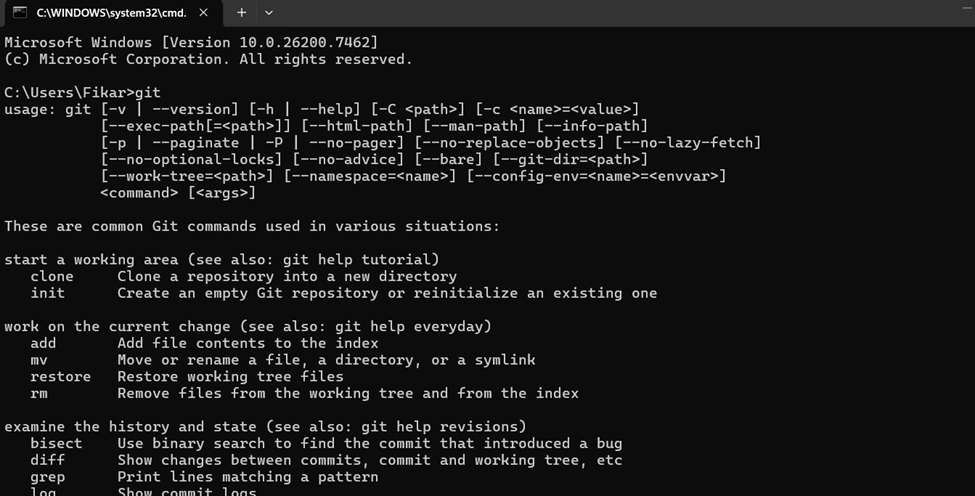
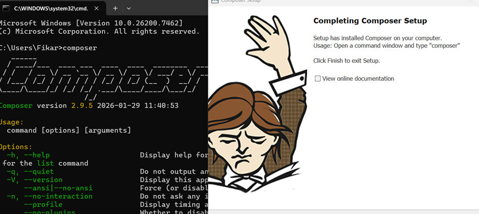
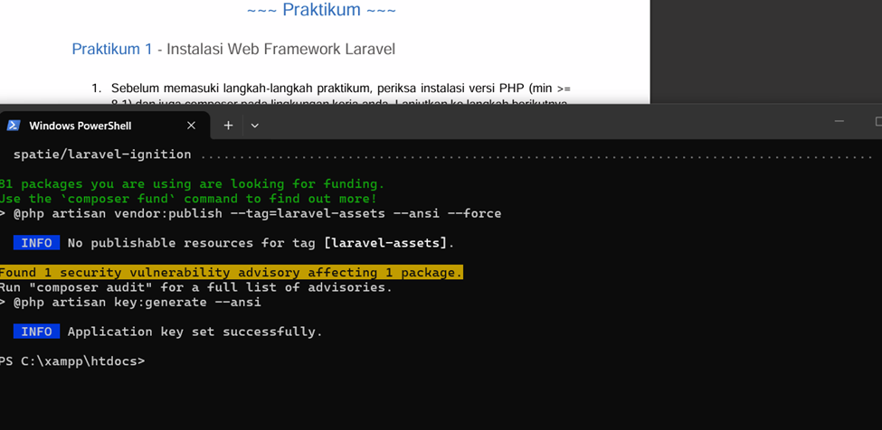
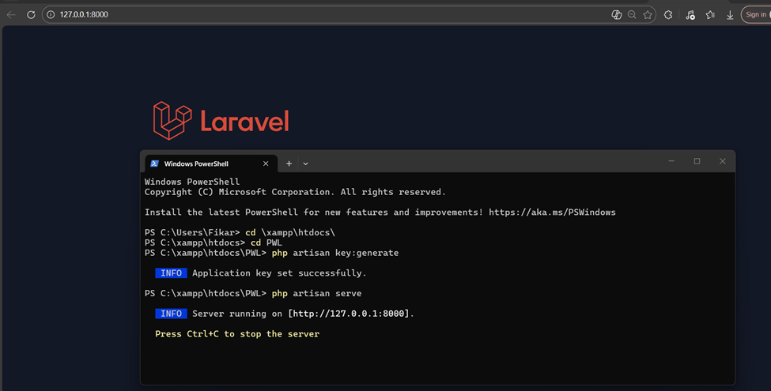
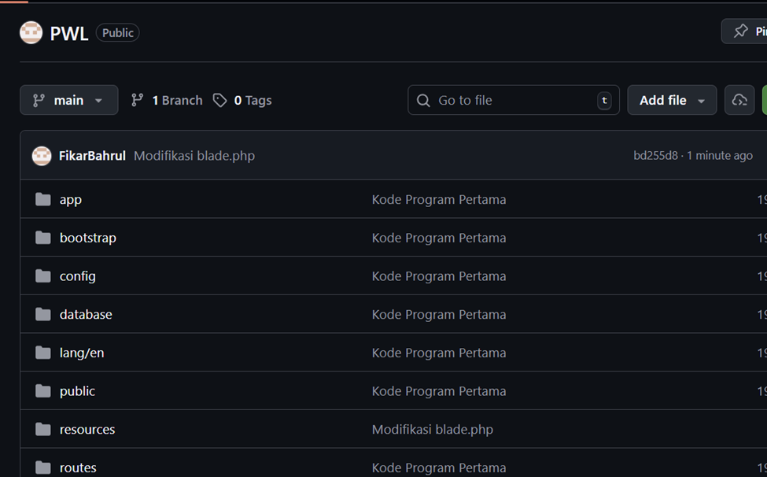
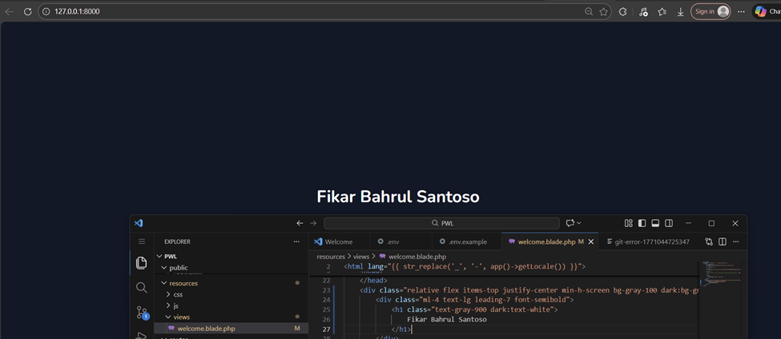

# Laporan Praktikum Pemrograman Web Lanjut

## Identitas Mahasiswa

| Keterangan | Data |
|------------|------|
| **Nama**   | Fikar Bahrul Santoso |
| **NIM**    | 244107020160 |
| **Kelas**  | TI-2F |

---

## Persiapan

Proses Instalasi git

---
Proses Instalasi composer

---
## Praktikum 1

Detail

Proses Instalasi Laravel

---

---

## Praktikum 2

Detail

Proses Menjalankan Laravel

---

## Praktikum 3

Detail

Menghubungkan ke Github

---
Modifikasi Welcome-blade

---