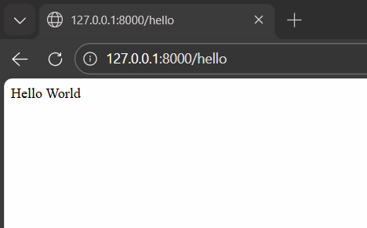
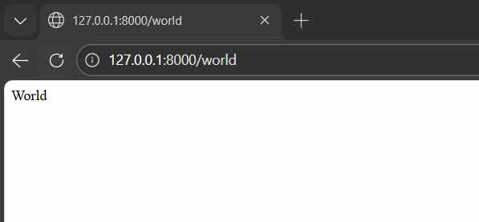
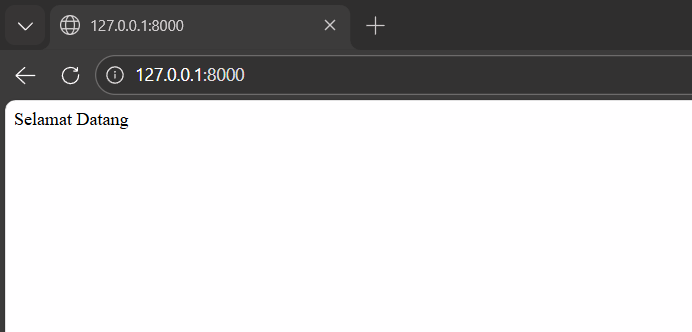
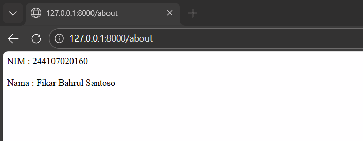
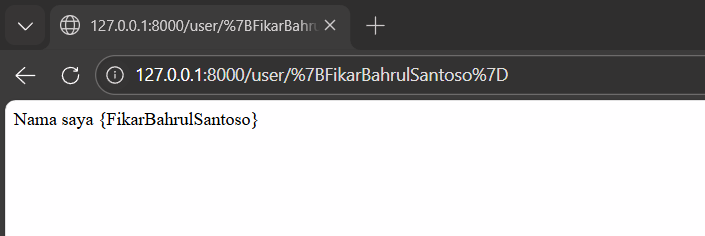
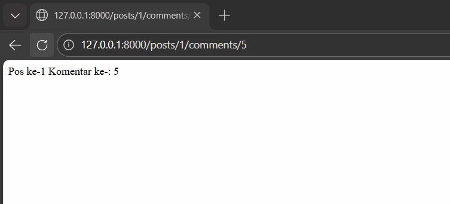
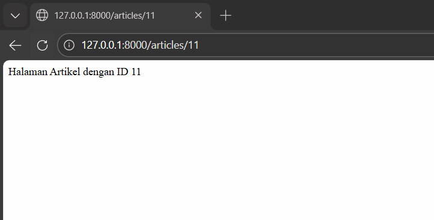
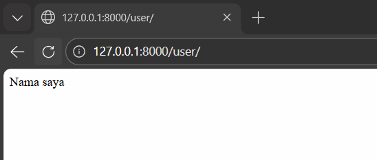
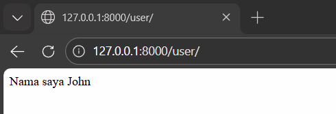

# Laporan Praktikum Pemrograman Web Lanjut

## Identitas Mahasiswa

| Keterangan | Data |
|------------|------|
| **Nama**   | Fikar Bahrul Santoso |
| **NIM**    | 244107020160 |
| **Kelas**  | TI-2F |

---
## Persiapan
* **Laravel menggunakan MVC (Model, View, Controller)**

*  Model berisi semua metode dan atribut yang diperlukan untuk berinteraksi dengan skema database yang ditentukan.
* View mewakili bagaimana informasi ditampilkan, digunakan untuk semua logika 
antarmuka pengguna perangkat lunak(bagian Frontend).
* Controller berperan sebagai perantara antara Model dan View, memproses semua 
masukan yang dikirim oleh pengguna dari View(bagian Backend).

---

* **Route**
* Route ini digunakan sebagai penghubung antara user dengan aplikasi (penentu URL).
Route yang umum digunakan :  
[detail Route](DokumentasiPWL/img/detail-route.png)
---
## Praktikum 1

Detail

* Modifikasi Web Routes /hello  

* Penjelasan :
Route Web /hello akan memanggil suatu fungsi yang bisa menampilkan kata "hello" sebagai respon

* Modifikasi Web Routes /world  

* Penjelasan :
Route Web /world akan memanggil suatu fungsi yang bisa menampilkan kata "world" sebagai respon tanpa "hello" yang tadi

* Modifikasi Web Routes / seperti landing page  

* Modifikasi Web Routes /about berisi identitas  

---

* **Route Parameter**
* Modifikasi Web Routes /user/{name}  

* Penjelasan :
halaman akan menampilkan teks "Nama saya [nama yang dimasukkan]" sesuai parameter tersebut melalui URL.

* Modifikasi Web Routes /posts/1/comments/5  

* Penjelasan :
Kode Route ini menangani URL dengan dua parameter dinamis ({post} dan {comment}), lalu menampilkan teks yang berisi ID post dan ID komentar yang diakses melalui variabel $postId dan $commentId.

* Modifikasi Web Routes /articles  

---
* Modifikasi Web Routes /user  

* Penjelasan :
halaman akan menampilkan teks "Nama saya" tanpa tambahan karena variabel null

* Modifikasi Web Routes /user  

* Penjelasan :
halaman akan menampilkan teks "Nama saya John" karena variabel sudah terisi nama John.

---

## Praktikum 2

Detail

---

## Praktikum 3

Detail

---

---