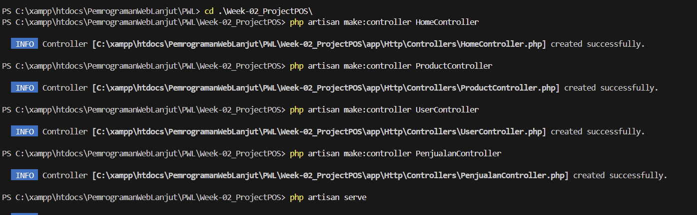
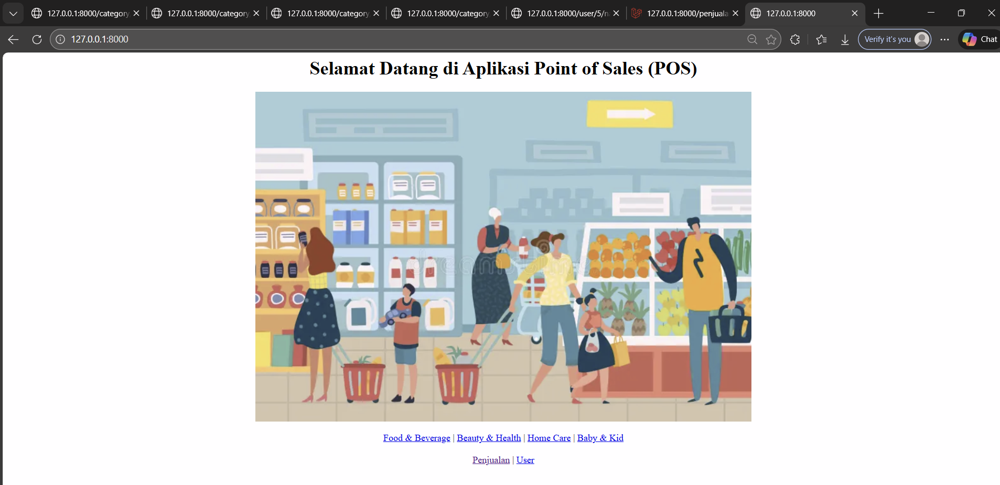
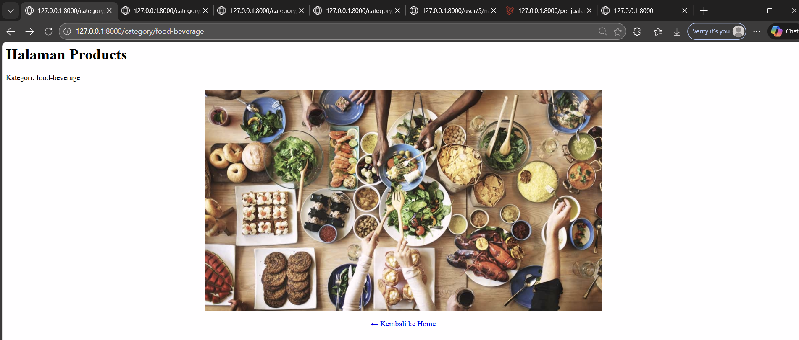
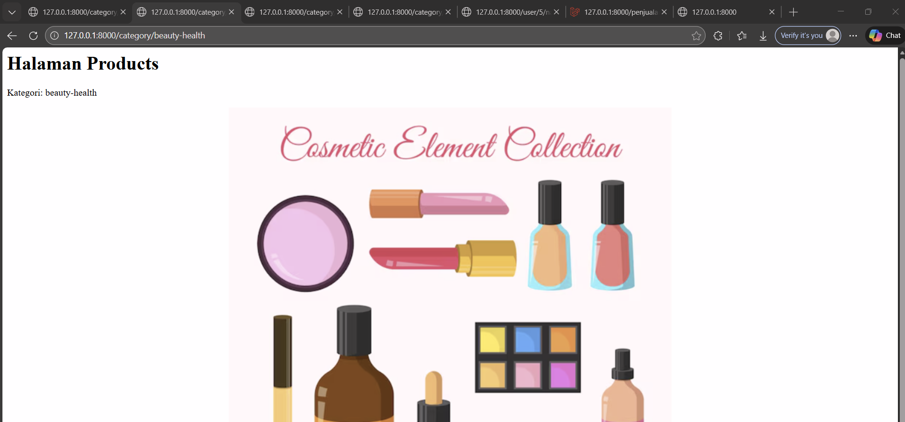
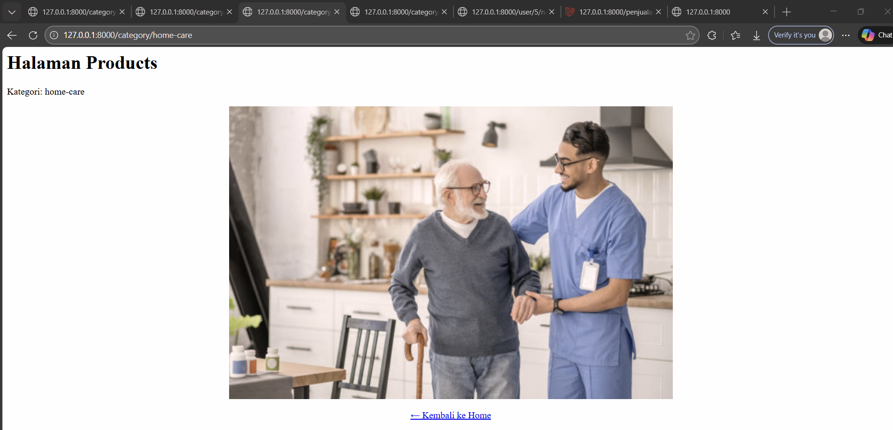
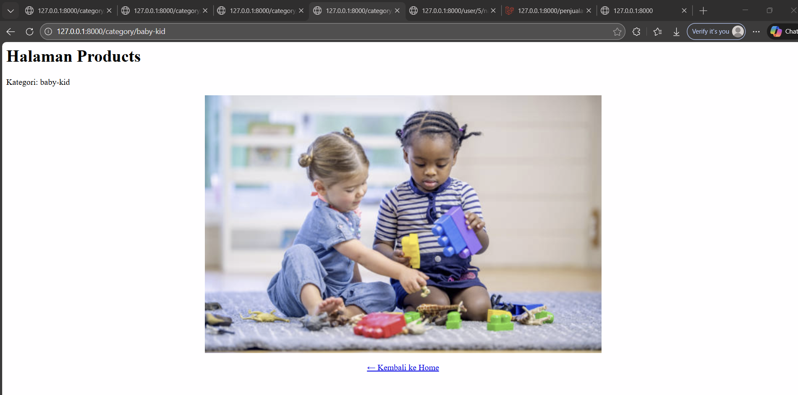
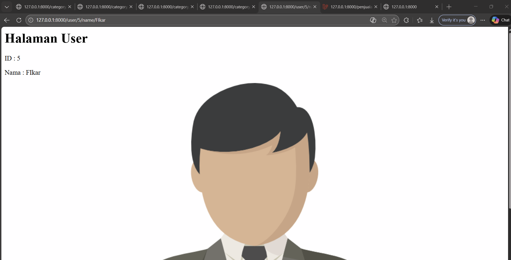
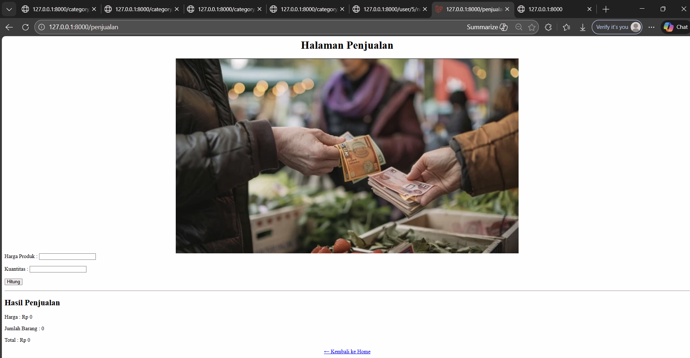

# Laporan Praktikum Pemrograman Web Lanjut

## Identitas Mahasiswa

| Keterangan | Data |
|------------|------|
| **Nama**   | Fikar Bahrul Santoso |
| **NIM**    | 244107020160 |
| **Kelas**  | TI-2F |

## Project POS

Detail

* **Proses pembuatan controller**

   

* **Halaman Home**

   

* **Halaman Product Category Food-Bevearage**

   

* **Halaman Product Category Beauty Health**

   

* **Halaman Product Category Home-care**

   

* **Halaman Product Category baby-kid**

   

* **Halaman User**

   

* **Halaman Penjualan**

   

<a href="https://github.com/FikarBahrul/PWL/blob/main/Week-02/README.md">Kembali</a>