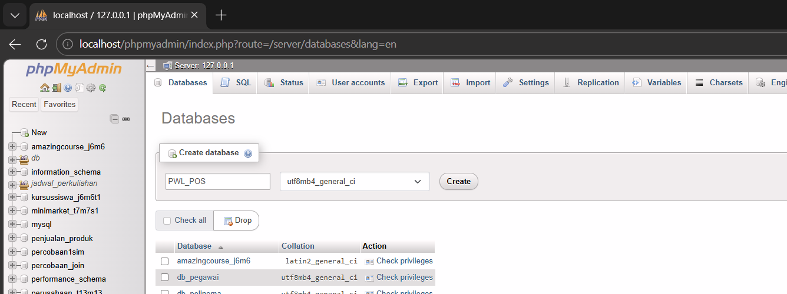
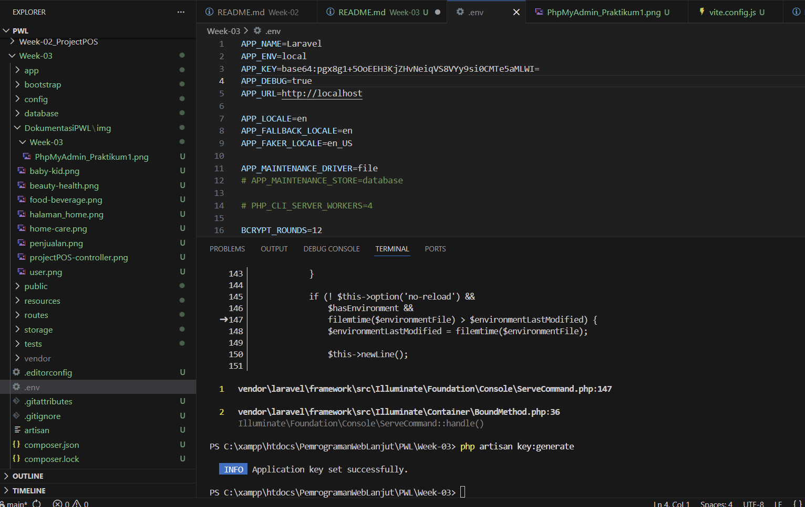
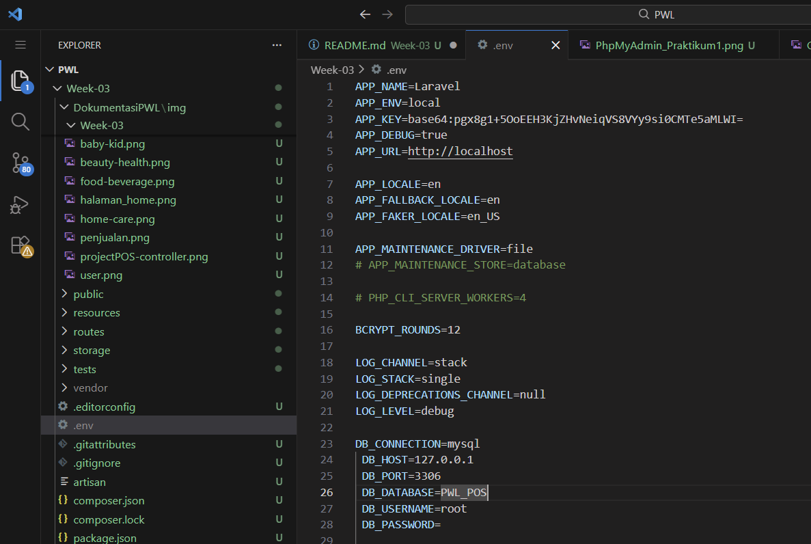
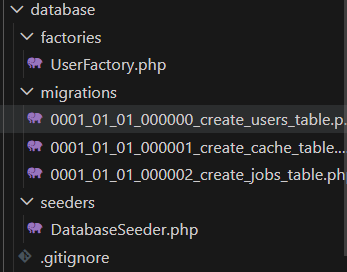
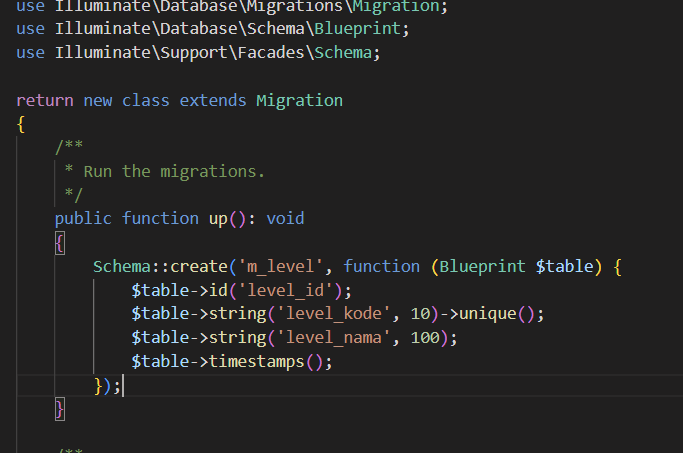
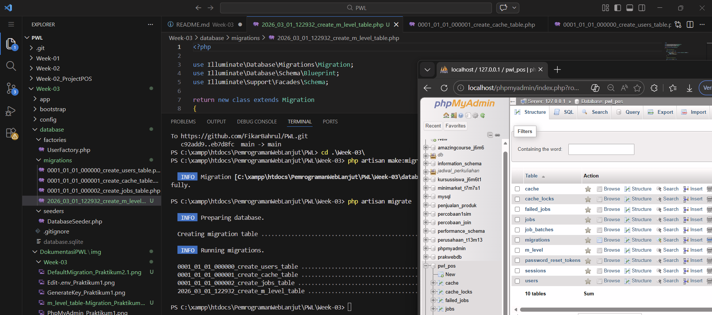
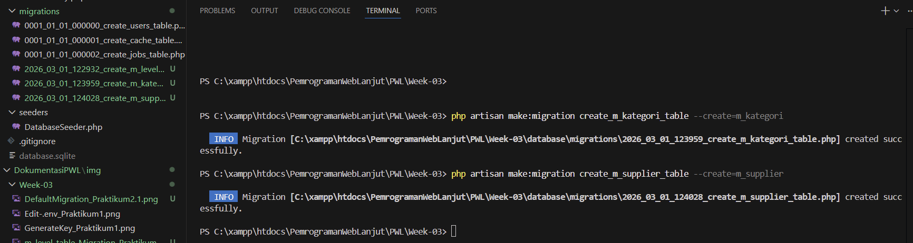
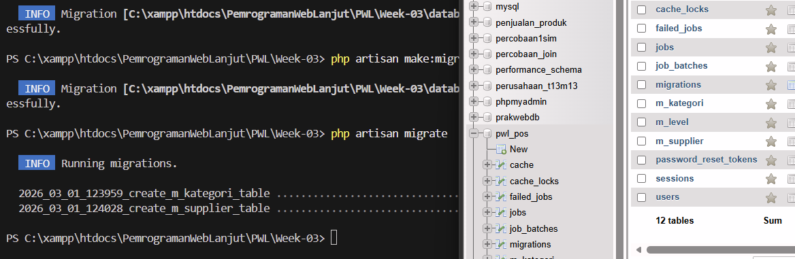
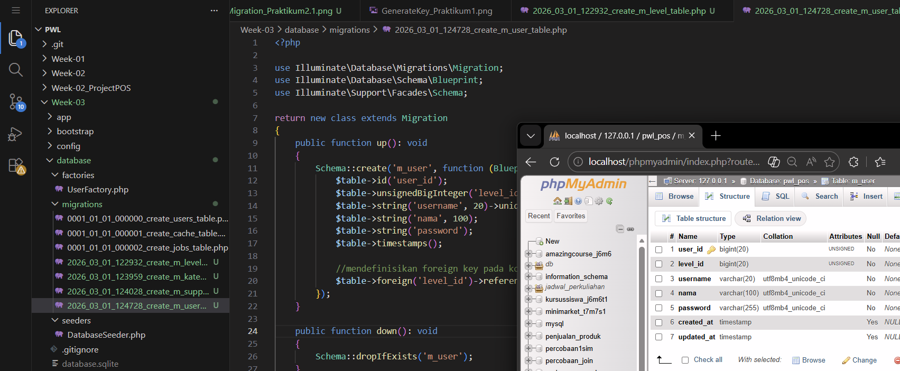
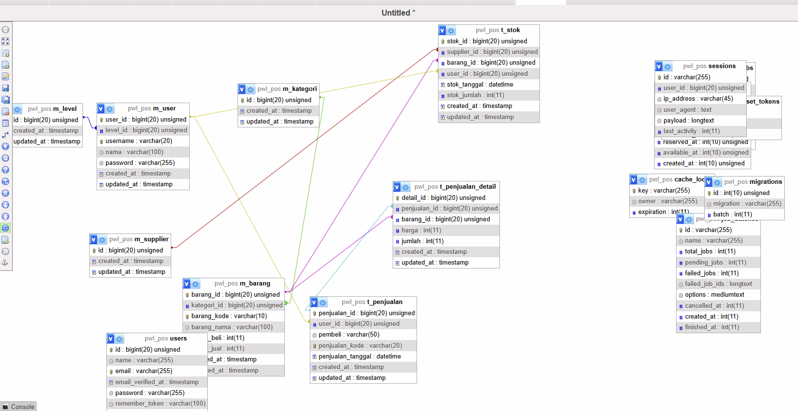

# Laporan Praktikum Pemrograman Web Lanjut

## Identitas Mahasiswa

| Keterangan | Data |
|------------|------|
| **Nama**   | Fikar Bahrul Santoso |
| **NIM**    | 244107020160 |
| **Kelas**  | TI-2F |

---
## Persiapan
* **Migration**

*  Dalam pertemuan ini akan mempelajari tentang migrasi, seed dan model yang akan masuk ke dalam Database
---
## Praktikum 1

Detail

* Buka aplikasi phpMyAdmin, dan buat database baru dengan nama PWL_POS  

* Generate Key di .env  

* Edit .env  

---

## Praktikum 2.1

Detail

* Default Migration File yang sudah ada dari Laravel  

* Buat File Migration baru (m_level)  

* Proses Migrasi  

* Buat File Migration baru (m_kategori & m_supplier)  

* Proses Migrasi kembali  

---

## Praktikum 2.2

Detail

* Migrasi m_user  

* DB Design  

---

