# Laporan Praktikum Pemrograman Web Lanjut

## Identitas Mahasiswa

| Keterangan | Data |
|------------|------|
| **Nama**   | Fikar Bahrul Santoso |
| **NIM**    | 244107020160 |
| **Kelas**  | TI-2F |

---
## Persiapan
* **Migration**

*  Dalam pertemuan ini akan mempelajari tentang migrasi, seed dan model yang akan masuk ke dalam Database
---
## Praktikum 1

Detail

* Buka aplikasi phpMyAdmin, dan buat database baru dengan nama PWL_POS  

* Generate Key di .env  

* Edit .env  

---

## Praktikum 2.1

Detail

* Default Migration File yang sudah ada dari Laravel  

* Buat File Migration baru (m_level)  

* Proses Migrasi  

* Buat File Migration baru (m_kategori & m_supplier)  

* Proses Migrasi kembali  

---

## Praktikum 2.2

Detail

* Migrasi m_user  

* DB Design  

---

## Praktikum 3

Detail

* Buat Seeder untuk table m_level   
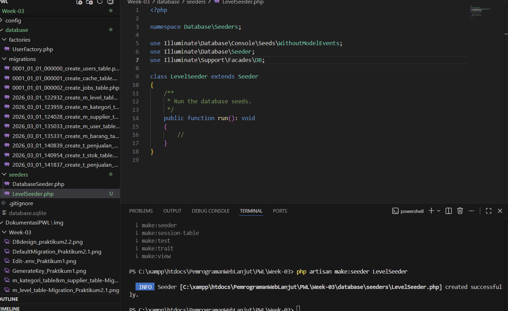

* Buat fungsi run untuk table m_level   
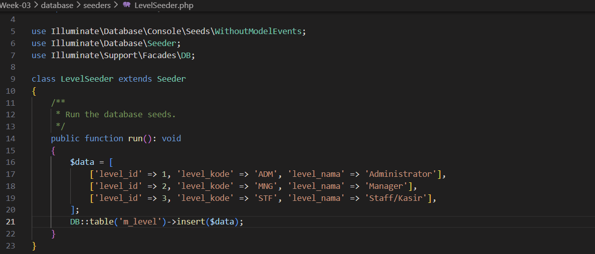

* Jalankan seeder untuk m_level   
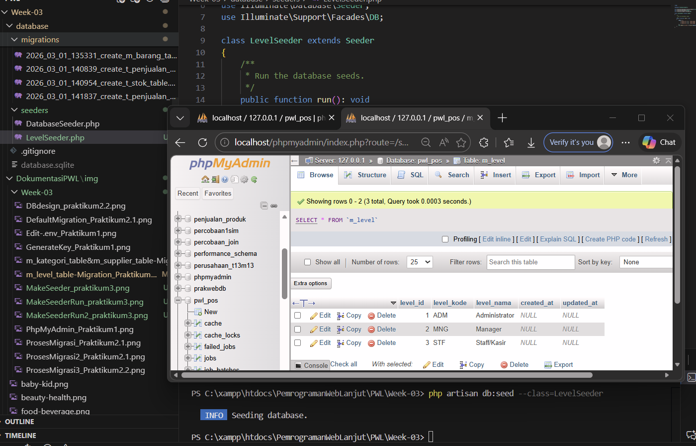

* Tambahkan & Jalankan seeder untuk m_user   
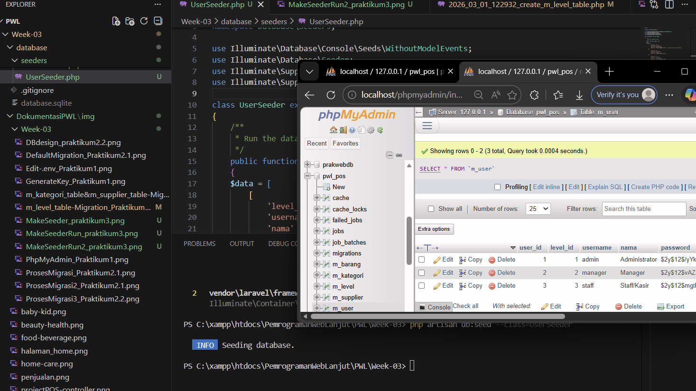

* Tambahkan & Jalankan seeder untuk tabel lain   

---

## Praktikum 4

Detail

* Buat LevelController   
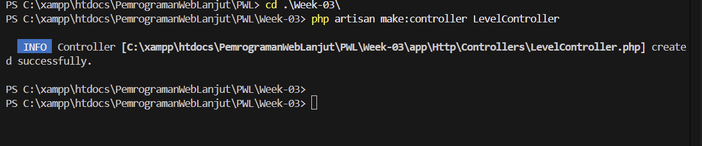

* Modifikasi Web.PHP   
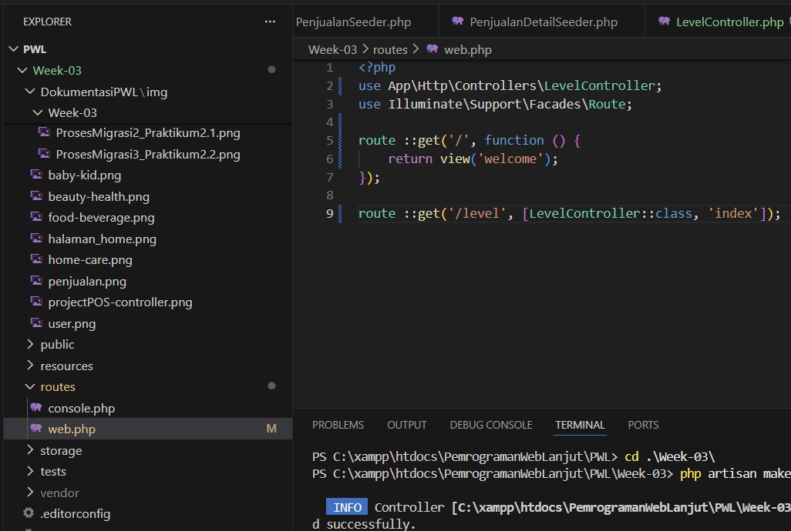

* Modifikasi Level Controller   
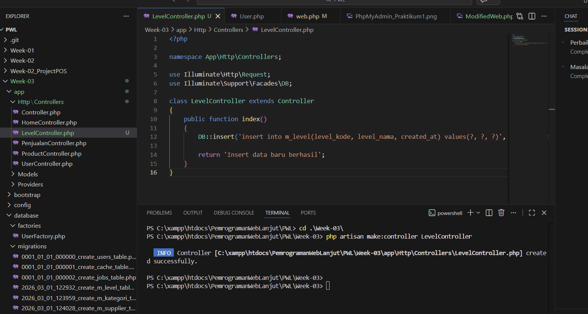
  

* Modifikasi Level Controller   
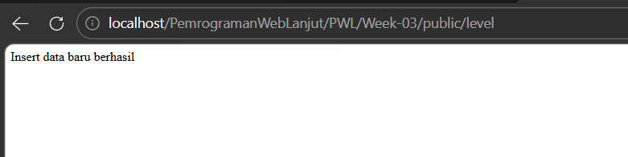
  

* Modifikasi Level Controller   
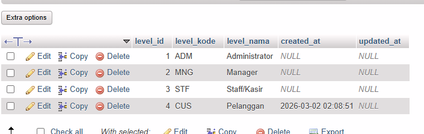
  

* Modifikasi Level Controller   
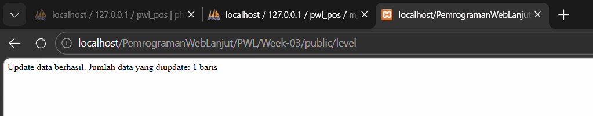
  

* Modifikasi Level Controller   
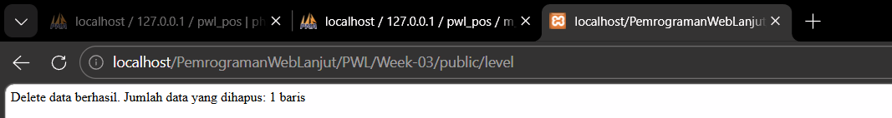

* Eksekusi LevelBlade  
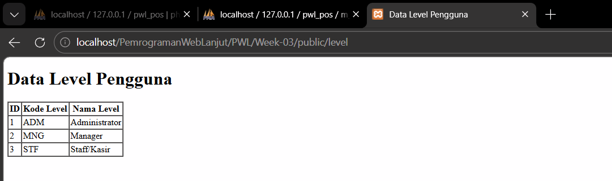

---

## Praktikum 5

Detail

* Eksekusi Kategori  
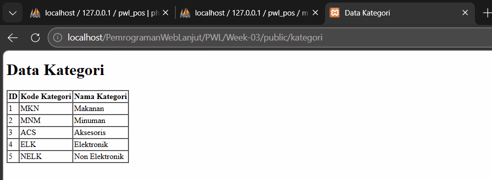

---

## Praktikum 6

Detail

* Eksekusi User  

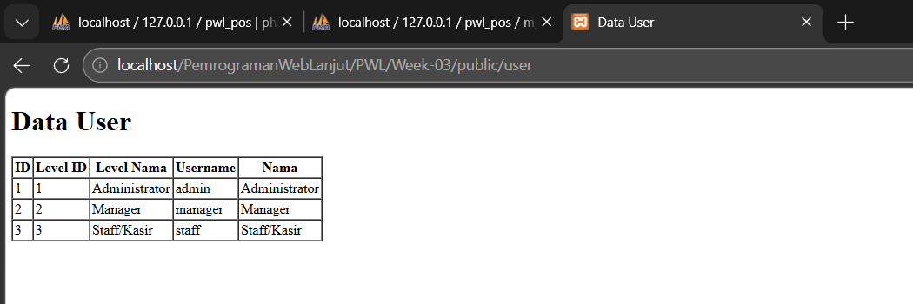

---

## Penutup

Detail

1. **Pada Praktikum 1 - Tahap 5, apakah fungsi dari APP_KEY pada file setting .env Laravel?**
   APP_KEY berfungsi sebagai kunci enkripsi untuk mengamankan data sesi dan cookie pada aplikasi Laravel.

2. **Pada Praktikum 1, bagaimana kita men-generate nilai untuk APP_KEY?**
   Nilai APP_KEY dapat di-generate menggunakan perintah `php artisan key:generate` pada terminal.

3. **Pada Praktikum 2.1 - Tahap 1, secara default Laravel memiliki berapa file migrasi? dan untuk apa saja file migrasi tersebut?**
   Secara default Laravel memiliki **4 file migrasi**, yaitu untuk tabel `users`, `password_reset_tokens`, `failed_jobs`, dan `personal_access_tokens`.

4. **Secara default, file migrasi terdapat kode $table->timestamps();, apa tujuan/output dari fungsi tersebut?**
   Fungsi `$table->timestamps()` digunakan untuk membuat dua kolom otomatis yaitu `created_at` dan `updated_at` yang menyimpan waktu data dibuat dan diubah.

5. **Pada File Migrasi, terdapat fungsi $table->id(); Tipe data apa yang dihasilkan dari fungsi tersebut?**
   Fungsi `$table->id()` menghasilkan tipe data **BIGINT UNSIGNED AUTO INCREMENT** sebagai primary key.

6. **Apa bedanya hasil migrasi pada table m_level, antara menggunakan $table->id(); dengan menggunakan $table->id('level_id');?**
   Perbedaannya adalah `$table->id()` membuat kolom primary key dengan nama `id`, sedangkan `$table->id('level_id')` membuat kolom primary key dengan nama `level_id`.

7. **Pada migration, Fungsi ->unique() digunakan untuk apa?**
   Fungsi `->unique()` digunakan untuk memastikan tidak ada nilai yang sama/duplikat pada kolom tersebut.

8. **Pada Praktikum 2.2 - Tahap 2, kenapa kolom level_id pada tabel m_user menggunakan $tabel->unsignedBigInteger('level_id'), sedangkan kolom level_id pada tabel m_level menggunakan $tabel->id('level_id')?**
   Kolom `level_id` pada `m_user` menggunakan `unsignedBigInteger` karena hanya sebagai foreign key biasa, sedangkan pada `m_level` menggunakan `id('level_id')` karena sebagai primary key yang auto increment.

9. **Pada Praktikum 3 - Tahap 6, apa tujuan dari Class Hash? dan apa maksud dari kode program Hash::make('1234');?**
   Class `Hash` digunakan untuk mengenkripsi data agar tidak tersimpan dalam bentuk teks biasa, dan `Hash::make('1234')` berarti mengenkripsi string `1234` menjadi bentuk hash.

10. **Pada Praktikum 4 - Tahap 3/5/7, pada query builder terdapat tanda tanya (?), apa kegunaan dari tanda tanya (?) tersebut?**
    Tanda tanya `(?)` pada query builder berfungsi sebagai **placeholder** untuk mencegah SQL injection, nilainya diisi dari array parameter yang diberikan.

11. **Pada Praktikum 6 - Tahap 3, apa tujuan penulisan kode protected $table = 'm_user'; dan protected $primaryKey = 'user_id';?**
    `protected $table = 'm_user'` bertujuan untuk memberitahu Eloquent nama tabel yang digunakan, dan `protected $primaryKey = 'user_id'` untuk memberitahu Eloquent nama kolom primary key pada tabel tersebut.

12. **Menurut kalian, lebih mudah menggunakan mana dalam melakukan operasi CRUD ke database (DB Façade / Query Builder / Eloquent ORM)? jelaskan**
    Menurut saya **Eloquent ORM** lebih mudah digunakan karena penulisannya lebih ringkas dan tidak perlu menulis query SQL secara langsung.

