# Laporan Praktikum Pemrograman Web Lanjut

## Identitas Mahasiswa

| Keterangan | Data |
|------------|------|
| **Nama**   | Fikar Bahrul Santoso |
| **NIM**    | 244107020160 |
| **Kelas**  | TI-2F |

---
## Persiapan

Detail

* Topik pembelajaran pada Week 4 membahas penggunaan Model dan Eloquent ORM dalam Laravel untuk mengelola data pada database secara lebih mudah dan terstruktur. Materi dimulai dari penggunaan mass assignment dengan $fillable untuk menentukan kolom yang boleh diisi secara otomatis demi menjaga keamanan data. Selanjutnya dipelajari berbagai cara mengambil data dari database seperti find(), first(), dan where(), serta exception handling menggunakan findOrFail() atau firstOrFail() ketika data tidak ditemukan. Selain itu, dibahas juga aggregate functions seperti count(), sum(), avg(), max(), dan min() untuk memperoleh statistik data. Praktikum ini juga mencakup operasi CRUD (Create, Read, Update, Delete) menggunakan Eloquent yang mempermudah manipulasi data, serta database relationships seperti belongsTo, hasMany, hasOne, dan belongsToMany untuk menghubungkan data antar tabel dalam database.

---
## Praktikum 1

Detail

Pada Praktikum 1 dilakukan pengujian penggunaan properti **$fillable** pada model Laravel. Properti ini digunakan untuk menentukan kolom mana saja pada tabel yang boleh diisi menggunakan fitur **mass assignment** seperti method `create()` atau `update()`. Dengan adanya `$fillable`, Laravel dapat membatasi atribut yang boleh dimasukkan ke database sehingga dapat meningkatkan keamanan aplikasi.
  
Pada langkah pertama,file **UserModel.php** dimodifikasi dengan menambahkan variabel `$fillable` yang berisi daftar atribut seperti `username`, `nama`, `password`, dan `level_id`. Konfigurasi ini memungkinkan data tersebut dapat diisi secara langsung melalui controller tanpa harus menetapkan nilai satu per satu.

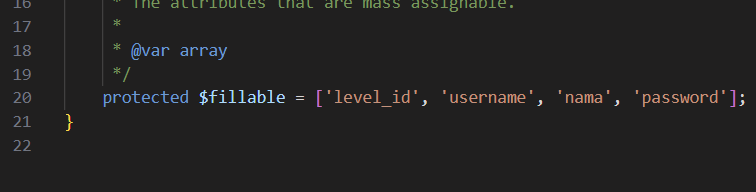

Selanjutnya pada **UserController.php**, proses penambahan data diubah menggunakan metode mass assignment dengan memasukkan data dalam bentuk array. Dengan cara ini, Laravel akan secara otomatis mengisi atribut model sesuai dengan kolom yang telah didaftarkan pada `$fillable`.

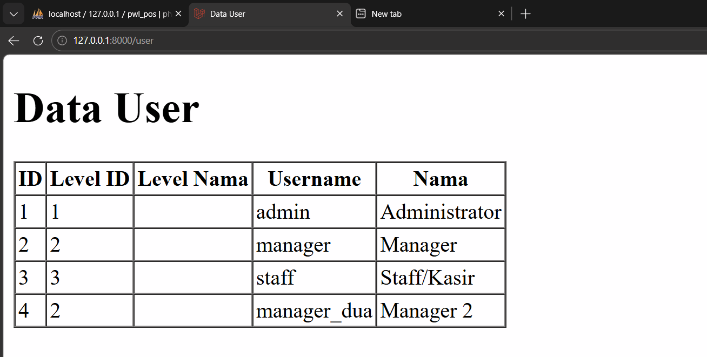
  
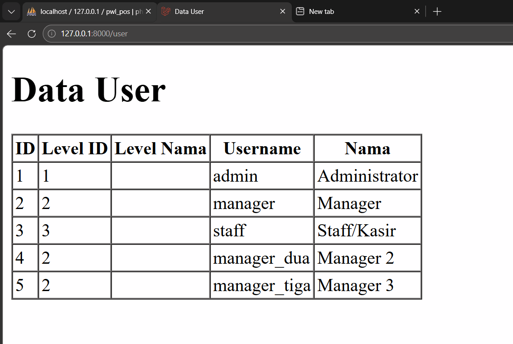

Dari hasil pengujian dapat disimpulkan bahwa `$fillable` berfungsi sebagai mekanisme pengamanan dalam Eloquent ORM untuk mengontrol atribut yang dapat diisi secara massal. Jika suatu kolom tidak terdaftar di `$fillable`, maka Laravel tidak akan memproses input tersebut saat melakukan penyimpanan data ke database.

---

## Praktikum 2.1

Detail

Fungsi Retrieving Single Models adalah untuk mengambil data baris dari database
 
find($id) akan mengambil data berdasarkan primary key (pada kasus ini, id 1 diambil)

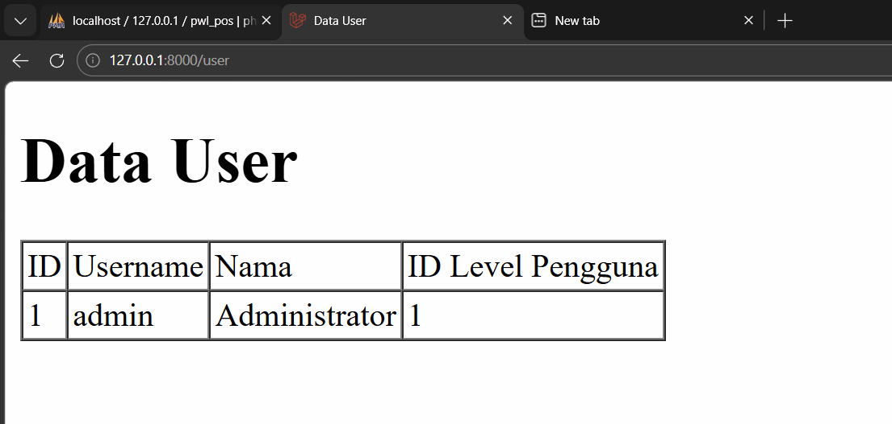
 
$user = UserModel::where('level_id', 1)->first(); 

akan mengambil data dengan kriteria level_id yang sudah ditentukan (pada kasus ini, level_id 1)
 

 $user = UserModel::firstWhere('level_id', 1); 

sama seperti sebelumnya namun yang baris pertama didahulukan.

 

 $user = UserModel::findOr(1, ['username','nama'], function () {abort(404);});
  
Kode tersebut digunakan untuk mencari data user dengan ID = 1 menggunakan findOr(), dan jika data tidak ditemukan maka akan menjalankan fungsi abort(404) sehingga halaman menampilkan error 404.

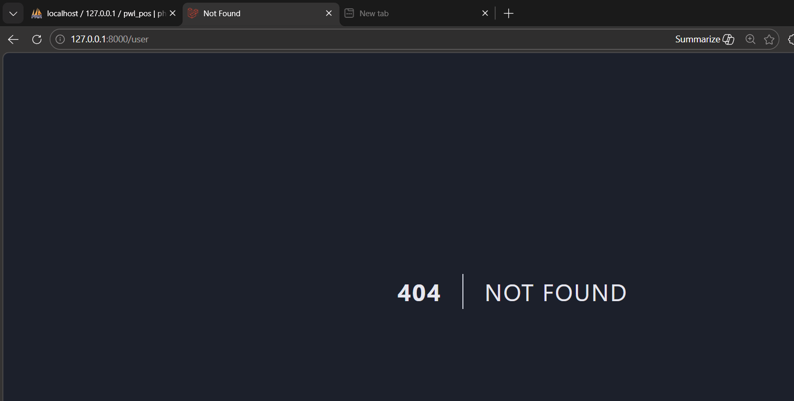

---

## Praktikum 2.2

Detail

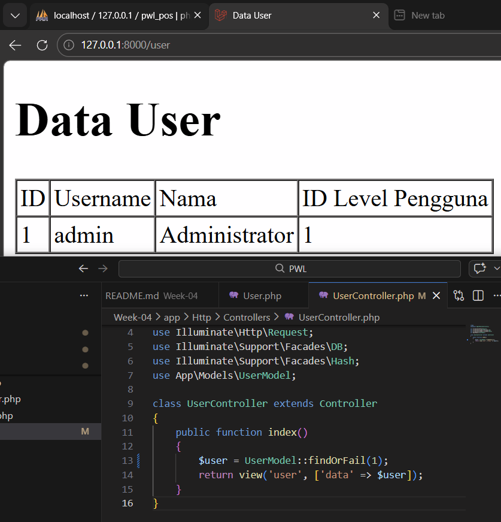
UserModel::findOrFail(1)
Kode ini digunakan untuk mencari data user dengan ID = 1, dan jika data tidak ditemukan maka Laravel otomatis menampilkan error 404

 
 

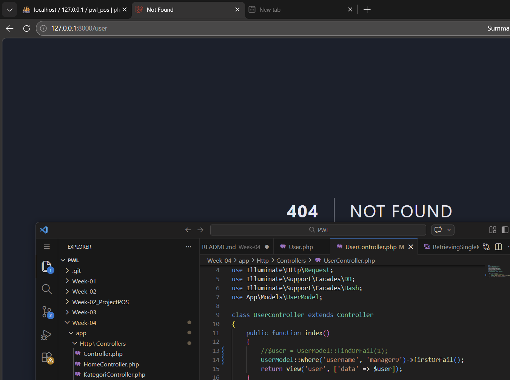
Kode ini digunakan untuk mencari data user dengan username manager9, dan jika tidak ada data yang ditemukan maka Laravel akan menampilkan error 404

---

## Praktikum 2.3

Detail

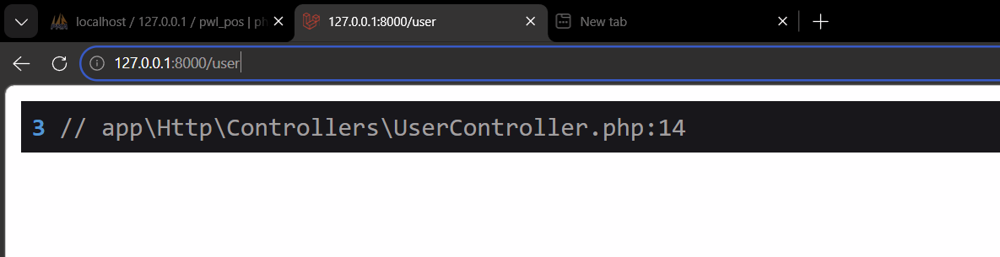
Kode tersebut digunakan untuk menghitung jumlah data user yang memiliki level_id = 2 pada tabel menggunakan method count() dari Eloquent. Hasil perhitungan tersebut kemudian ditampilkan menggunakan dd() untuk melihat jumlah data yang ditemukan.
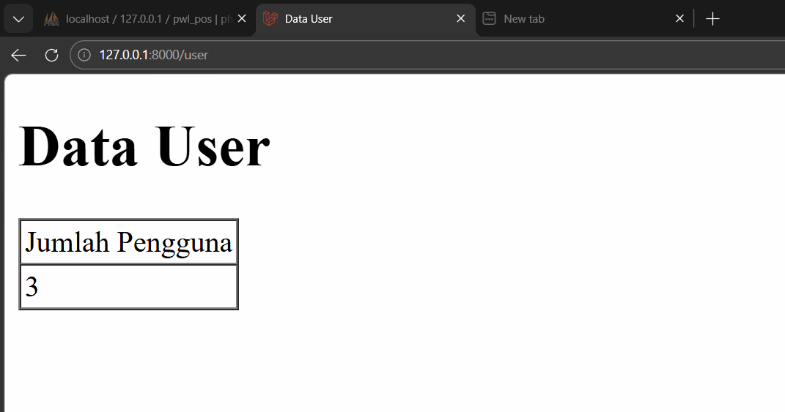

---

## Praktikum 2.4

Detail

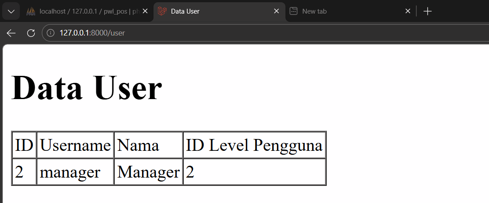

$user = UserModel::firstOrCreate([]);

 

akan mencari keseluruhan data, jika tidak ditemukan maka akan buat baru

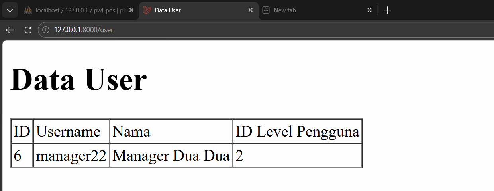

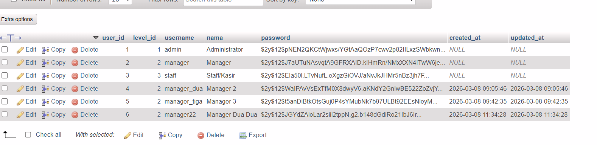

 
membuat data baru manager33 (Method firstOrNew hanya membuat objek di memori tanpa langsung menyimpan ke database, sehingga diperlukan pemanggilan ->save() agar dapat terlihat di database)

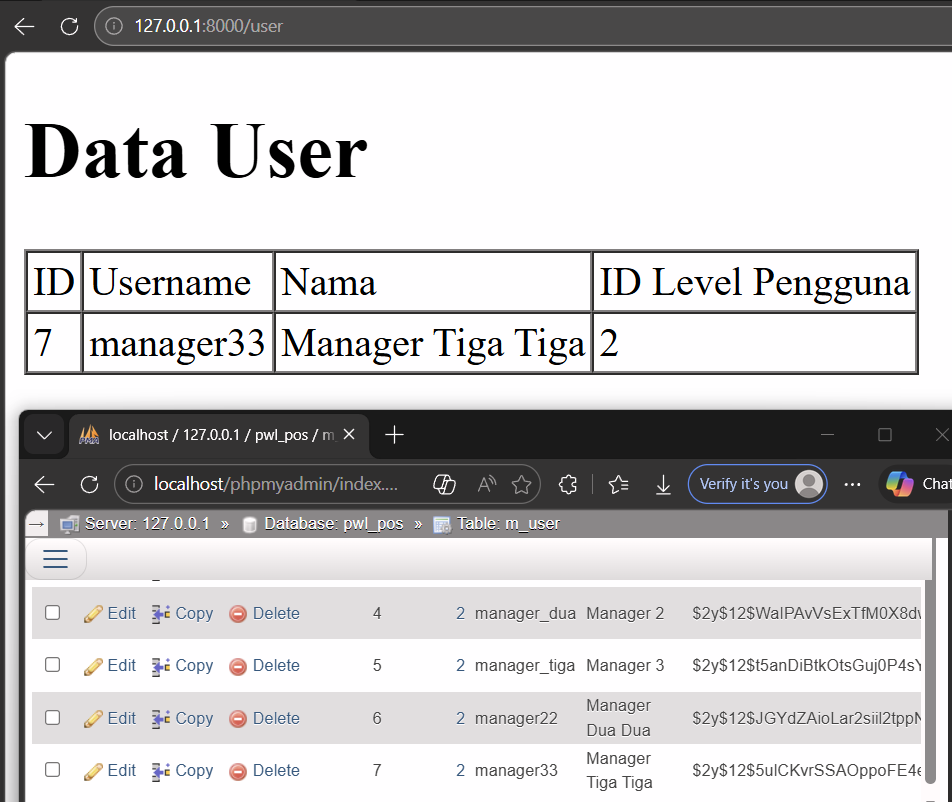

---

## Praktikum 2.5

Detail

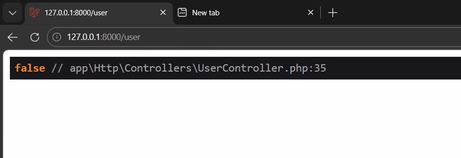

Setelah ->save() dipanggil, perubahan pada objek tersimpan ke database sehingga isDirty() mengembalikan false dan isClean() mengembalikan true, menandakan bahwa objek sudah sinkron dengan data di database. Fungsi dd() digunakan untuk menampilkan nilai isDirty() secara langsung di browser sebagai debugging
 

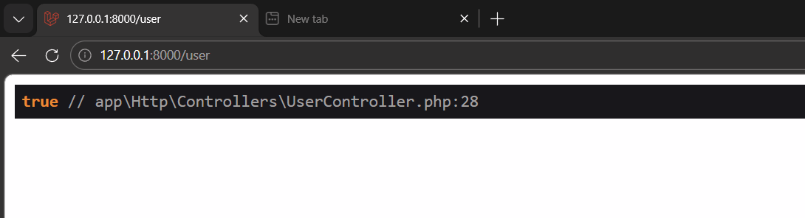

Setelah ->save() dipanggil, wasChanged() mengembalikan true pada field yang baru saja diubah dan tersimpan, seperti username yang berubah dari manager11 menjadi manager12. Berbeda dengan isDirty(), wasChanged() hanya bernilai true setelah data berhasil disimpan ke database, bukan sebelumnya
 

---

## Praktikum 2.6

Detail

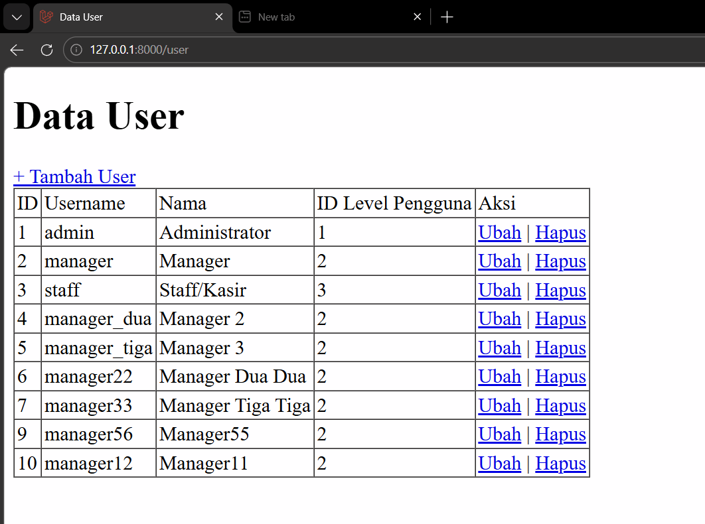

Method all() digunakan untuk mengambil seluruh data dari tabel m_user dan mengirimkannya ke view user.blade.php melalui variabel $data. Data kemudian ditampilkan dalam bentuk tabel HTML menggunakan @foreach, disertai link untuk aksi ubah dan hapus pada setiap baris data (Read dalam CRUD)

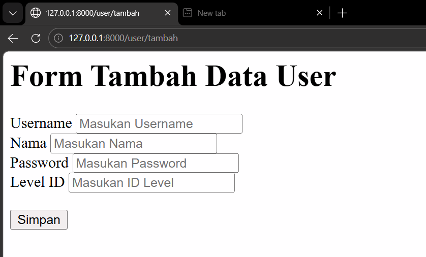

Setelah interaksi dengan link "+ Tambah User" akan langsung dialihkan menuju form tambah

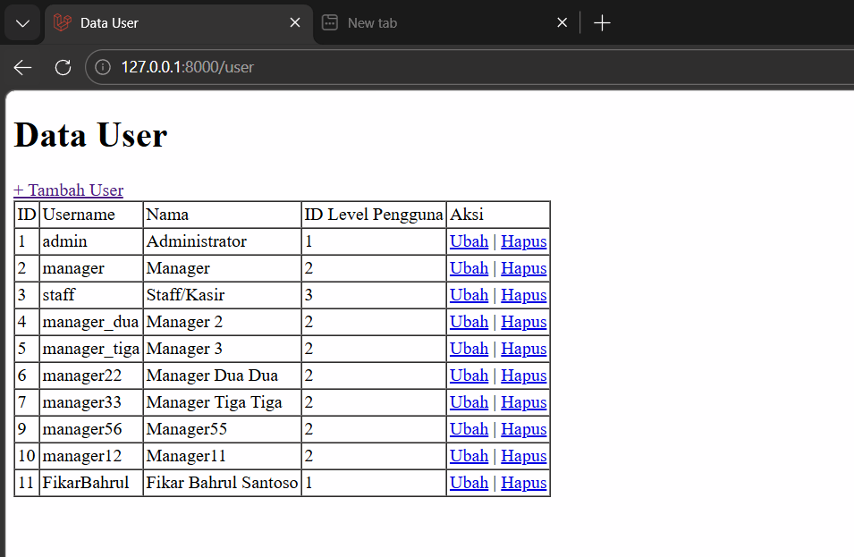

ketika sudah submit akan terbaca kembali di halaman user.

  

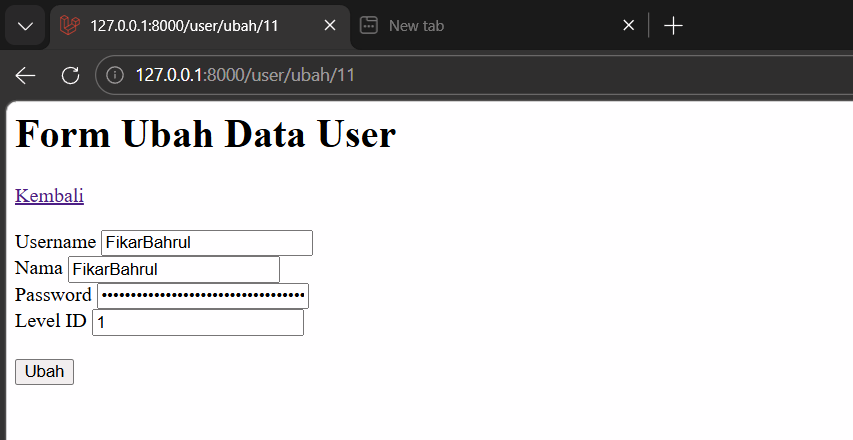

Setelah interaksi dengan link aksi "Ubah" akan langsung dialihkan menuju form Ubah Data

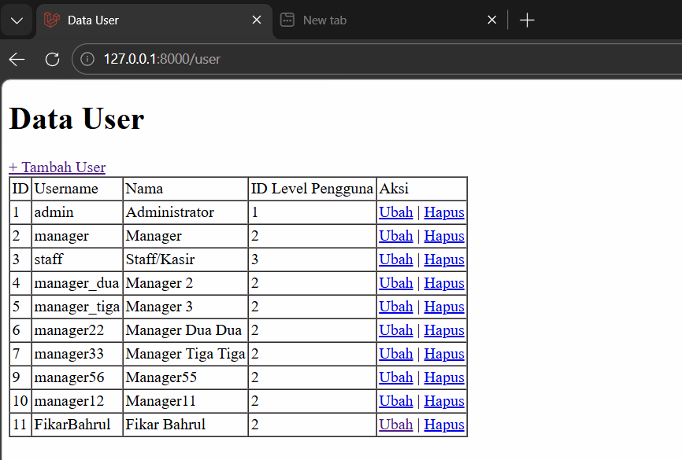

ketika sudah submit akan terbaca kembali di halaman user dengan perubahan yang tersimpan.

  

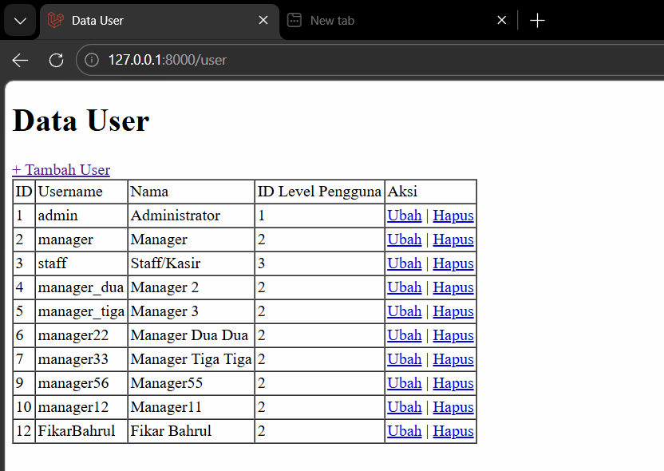

Setelah interaksi dengan link aksi "Hapus" akan langsung menghapus data pada tabel

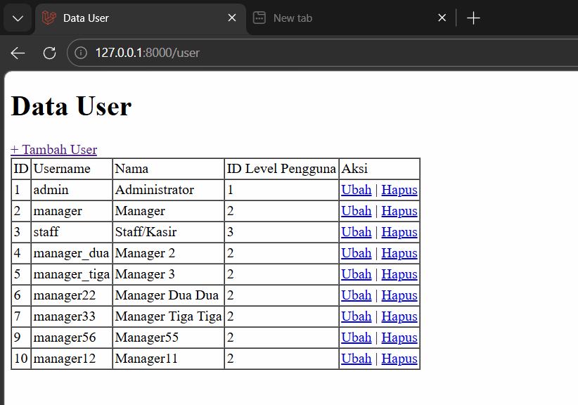
 

---