# Laporan Praktikum Pemrograman Web Lanjut

## Identitas Mahasiswa

| Keterangan | Data |
|------------|------|
| **Nama**   | Fikar Bahrul Santoso |
| **NIM**    | 244107020160 |
| **Kelas**  | TI-2F |

---
## Jobsheet 1

Detail

---
## Langkah Install Filament v4

### A. Persiapan
1. Pastikan web server dan MySQL sudah berjalan.
2. Pastikan file .env sudah berisi konfigurasi database MySQL yang benar.
3. Jalankan migrasi Laravel terlebih dahulu agar tabel dasar terbentuk.

Perintah yang digunakan:

	php artisan migrate

### B. Install Package Filament
1. Install Filament v4 menggunakan Composer.
2. Tunggu proses download dependency sampai selesai.

Perintah yang digunakan:

	composer require filament/filament:"^4.0"

### C. Install Panel Builder
1. Jalankan installer panel Filament.
2. Isi Panel ID dengan admin.
3. Saat pertanyaan GitHub star muncul, pilih no.

Perintah yang digunakan:

	php artisan filament:install --panels

### D. Membuat User Admin
1. Buat akun admin agar bisa login ke panel.
2. Isi data user sesuai jobsheet.

Perintah yang digunakan:

	php artisan make:filament-user

Contoh data:
1. Name: admin user
2. Email: admin@gmail.com
3. Password: 12345678

### E. Akses Panel Admin
Jika menggunakan php artisan serve:
1. Jalankan server:

	php artisan serve

2. Buka URL:
   http://127.0.0.1:8000/admin/login

Jika akses langsung lewat web server lokal (tanpa virtual host), gunakan URL yang menyertakan folder project dan public:
http://localhost/PemrogramanWebLanjut/PWL/Week-05/PraktikumPWL/public/admin/login

---
## E. Analisis & Diskusi

### 1. Apa kelebihan Filament dibanding membuat admin panel manual?
Filament mempercepat pengembangan karena banyak fitur admin sudah siap pakai, seperti autentikasi panel, CRUD resource, tabel, form, filter, notifikasi, dan otorisasi berbasis Laravel. Developer jadi fokus ke logika bisnis, bukan membangun komponen admin dari nol.

### 2. Mengapa Filament menggunakan Livewire?
Livewire memungkinkan antarmuka yang interaktif tanpa banyak menulis JavaScript kompleks. Komponen Filament dapat memanfaatkan state dan validasi di sisi server (PHP) secara langsung, sehingga integrasi dengan Laravel lebih natural, produktivitas meningkat, dan kode lebih konsisten dalam satu stack.

### 3. Apa perbedaan SQLite dan MySQL dalam development?
SQLite ringan karena berbasis file tunggal, cocok untuk prototipe cepat, testing lokal sederhana, dan setup awal tanpa server database terpisah. MySQL lebih cocok untuk skenario aplikasi nyata karena mendukung concurrency lebih baik, manajemen user-host privilege, tuning performa, dan operasi data skala lebih besar.

### 4. Apa fungsi Panel Builder?
Panel Builder berfungsi menghasilkan struktur panel admin Filament secara otomatis, termasuk provider panel, route panel, halaman bawaan, serta integrasi aset. Dengan Panel Builder, pembuatan area admin menjadi terstandar, cepat, dan mudah dikembangkan ke banyak panel jika dibutuhkan.

---
## Jobsheet 2

Detail

membuat resource user
  

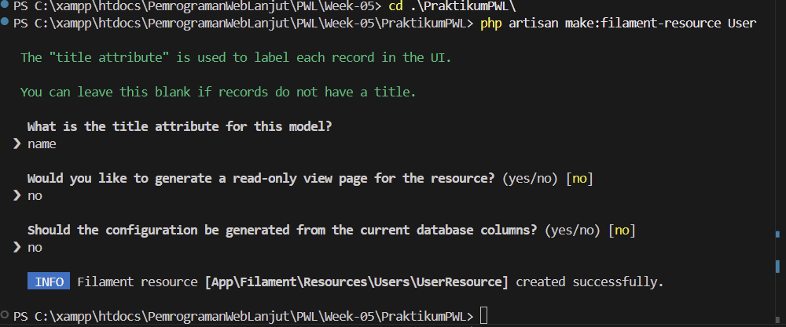

tampilan browser
  

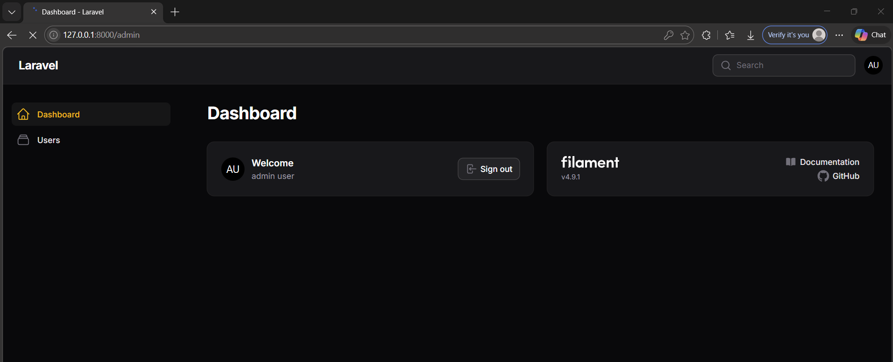

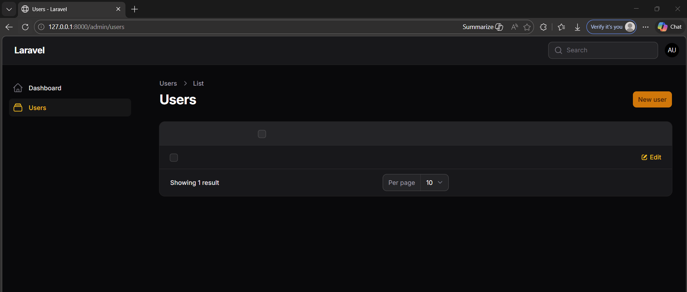

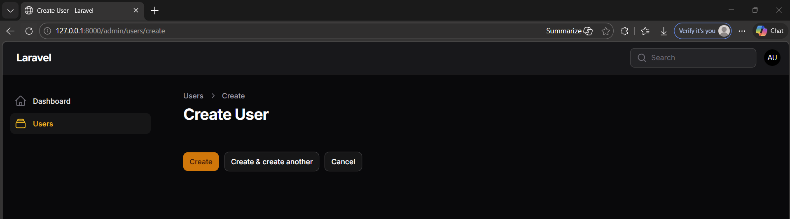

modifikasi form user (CreateEdit)
  
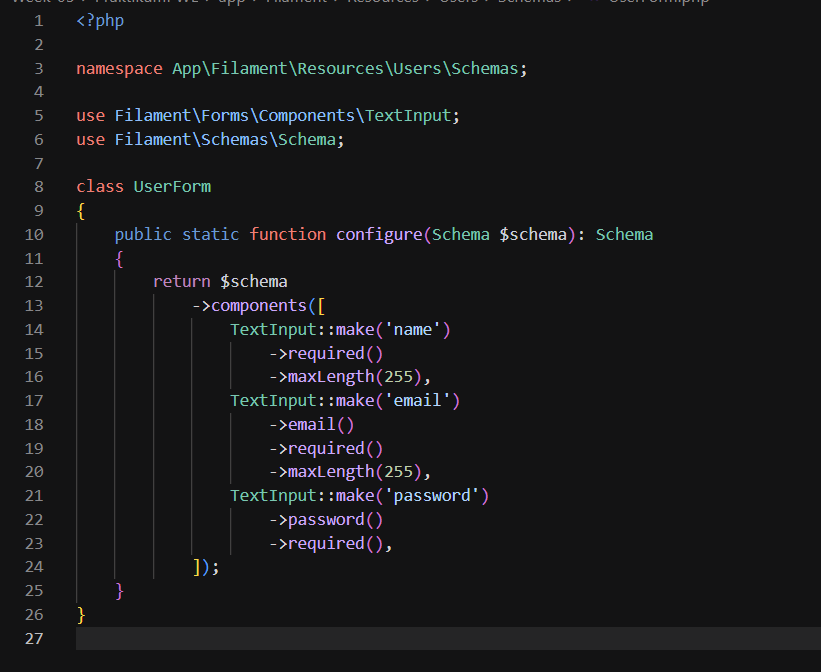

tampilan browser
  

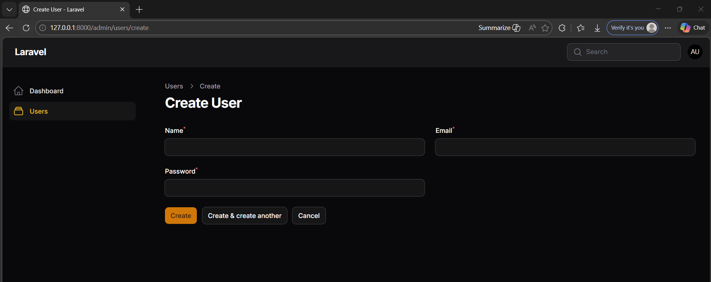

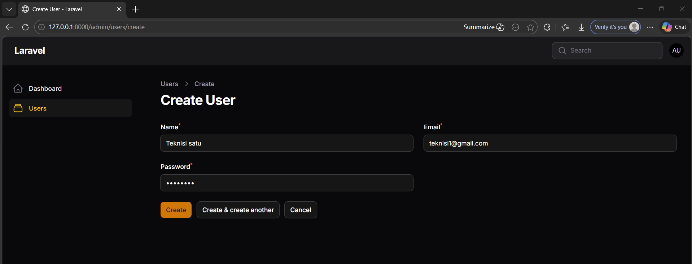

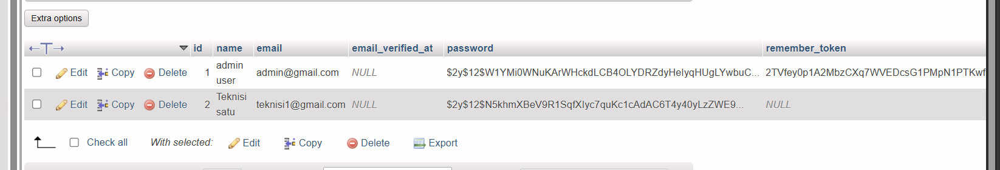

modifikasi form user (Read)
  

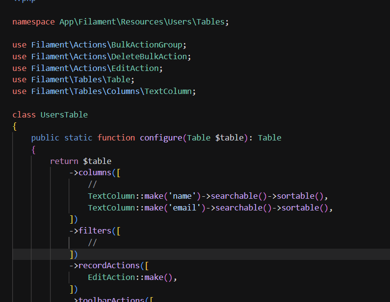

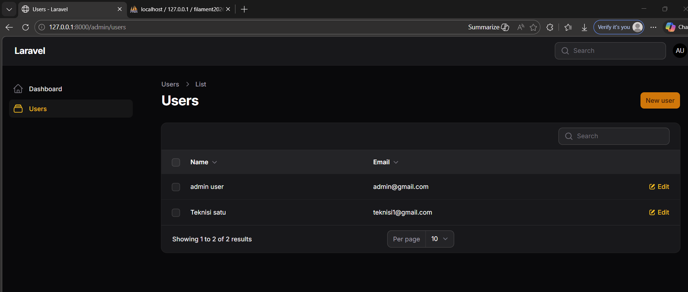

modifikasi icon user
  

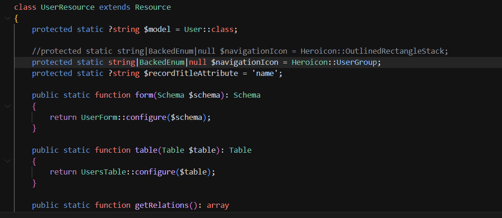

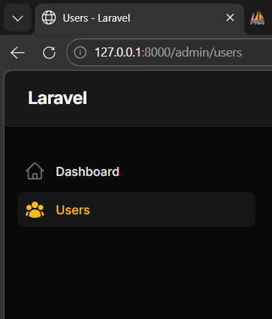

## E. Analisis & Diskusi

### 1. Mengapa Filament dapat membuat CRUD tanpa banyak coding?
Filament menggunakan sistem code generation berbasis artisan. Dengan satu perintah `make:filament-resource`, semua file yang dibutuhkan untuk CRUD sudah otomatis terbuat. Form Builder dan Table Builder Filament bersifat deklaratif sehingga developer cukup mendefinisikan field yang dibutuhkan tanpa menulis logika tampilan dari nol.

### 2. Apa perbedaan Form Schema dan Table Schema?
Form Schema (`UserForm.php`) mendefinisikan field input yang digunakan pada halaman Create dan Edit. Table Schema (`UsersTable.php`) mendefinisikan kolom yang ditampilkan pada halaman List beserta fitur sorting, searching, dan action button seperti Edit dan Delete.

### 3. Bagaimana jika kita ingin menambahkan validasi email unik?
Tambahkan method `->unique(ignoreRecord: true)` pada field email di `UserForm.php`. Parameter `ignoreRecord: true` digunakan agar validasi tidak konflik saat data sedang diedit, sehingga email yang sama tidak dianggap duplikat oleh record itu sendiri.

### 4. Mengapa password tidak perlu kita hash manual?
Laravel secara otomatis melakukan hashing password melalui mutator yang sudah terdefinisi di model `User`. Saat data disimpan menggunakan Eloquent, Laravel otomatis memanggil `bcrypt()` di balik layar sehingga developer tidak perlu melakukannya secara manual.

---
## Jobsheet 3

Detail

Membuat Model Category
  

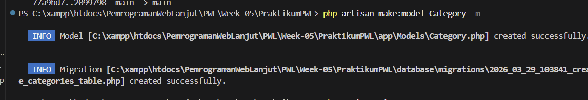

Mendesain Model Category
  

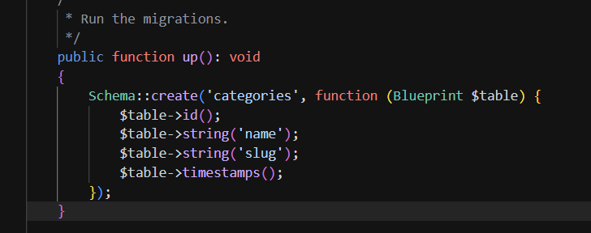
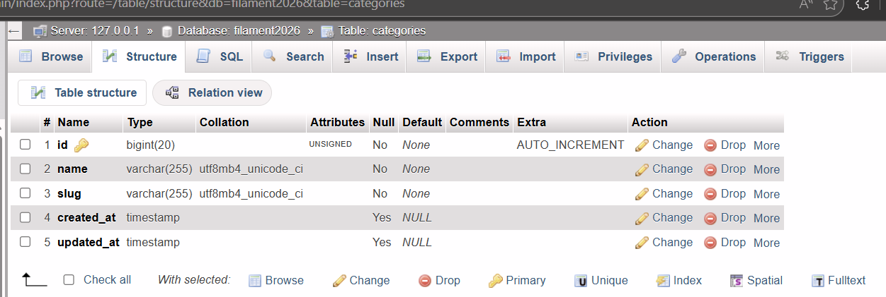

Mengatur fillable agar data dapat disimpan menggunakan mass assignment
  

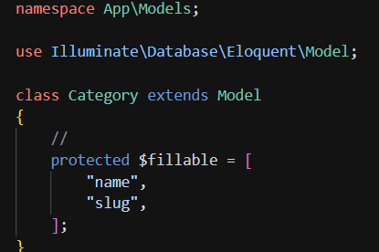

Membuat Model Post
  

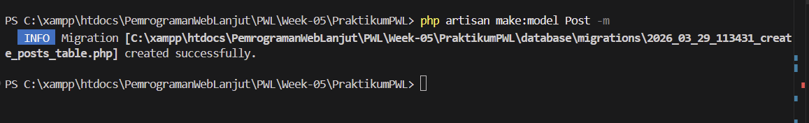

Mendesain Model Post
  

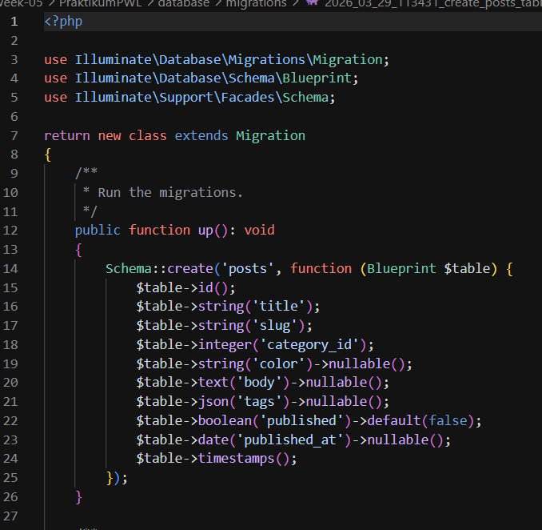

Mengatur Model Post (Fillable, Casting & Relation)
  

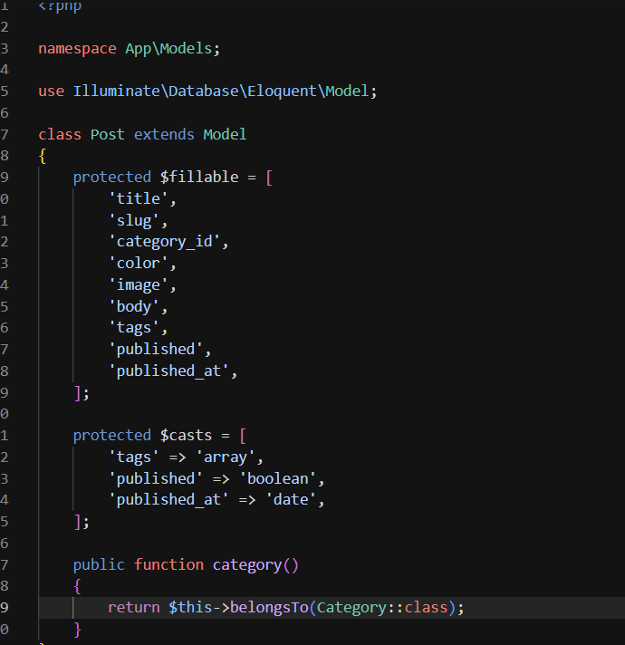

Membuat Resource Categories
  

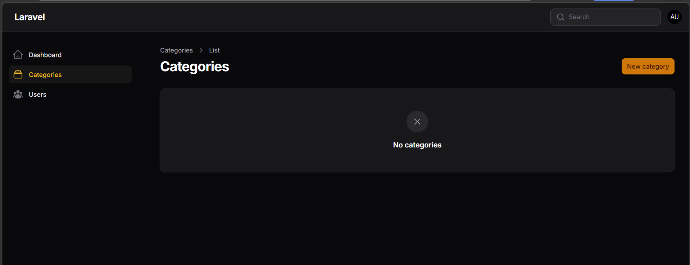

Edit Form Categories
  

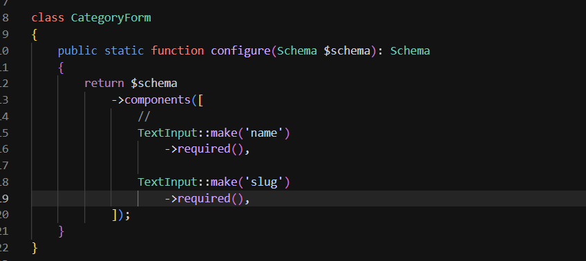
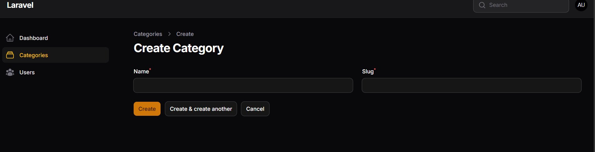

Edit Table Categories
  

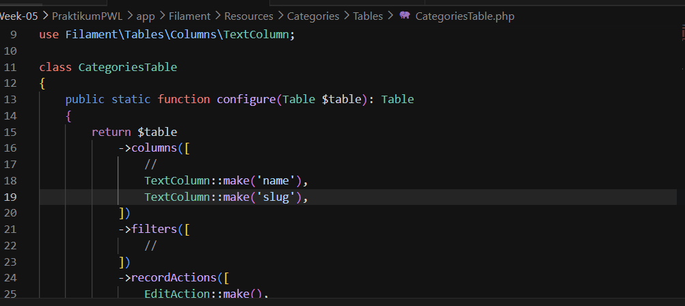
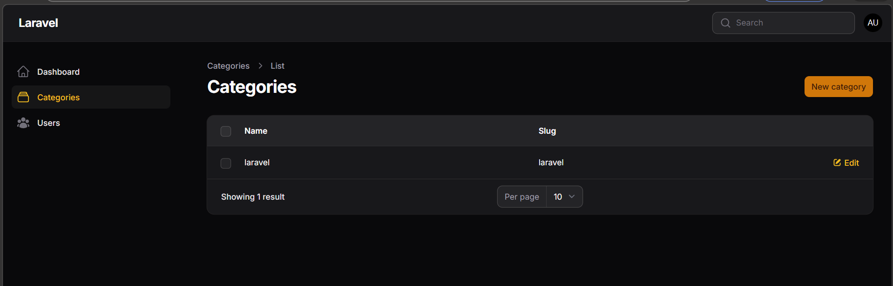

## E. Analisis & Diskusi

### 1. Mengapa kita perlu $fillable?
Property `$fillable` mendefinisikan kolom mana saja yang diizinkan untuk mass assignment (penyimpanan massal). Tanpa `$fillable`, Laravel akan mencegah semua kolom diedit sekaligus demi keamanan. Filament membutuhkan `$fillable` untuk dapat menyimpan data form ke database menggunakan model Eloquent secara otomatis.

### 2. Apa fungsi $casts pada Laravel?
`$casts` mengkonversi tipe data database otomatis menjadi tipe PHP yang sesuai. Misalnya, field `tags` dalam database berupa JSON string, tapi dengan `'tags' => 'array'`, Laravel otomatis mengonversi menjadi PHP array saat query. Casting juga membuat date fields menjadi Carbon instance dan boolean fields benar-benar boolean, sehingga kode lebih aman dan readable.

### 3. Apa perbedaan integer biasa dengan foreign key?
Integer biasa hanya menyimpan angka tanpa kaitan ke tabel lain, sehingga tidak ada proteksi integritas data. Foreign key adalah integer yang menunjuk ke primary key tabel lain dan database akan mencegah menyimpan nilai yang tidak ada di tabel referensi. Foreign key juga memastikan data tetap konsisten dan menghindari data orphan (data tanpa referensi).

### 4. Bagaimana jika category dihapus tetapi masih ada post?
Tanpa foreign key constraint, post akan tetap ada dengan `category_id` yang menunjuk ke category yang tidak lagi ada. Dengan foreign key yang dikonfigurasi `onDelete('cascade')`, semua post akan otomatis terhapus jika categorynya dihapus. Atau dengan `onDelete('restrict')`, penghapusan category akan ditolak jika masih ada post terkait, memaksa delete post terlebih dahulu.

## Kesimpulan

Filament PHP v4 terbukti mempercepat proses pembangunan admin panel berbasis Laravel secara signifikan. Dengan memanfaatkan fitur Resource, Form Builder, dan Table Builder, pembuatan halaman CRUD tidak lagi membutuhkan banyak kode manual. Struktur database yang dirancang dengan baik — mencakup penggunaan `$fillable`, `$casts`, dan relasi antar model — menjadi fondasi penting sebelum membangun fitur lebih lanjut. Keseluruhan praktikum ini menunjukkan bahwa kombinasi Laravel dan Filament dapat menjadi solusi efisien dalam pengembangan aplikasi web yang membutuhkan panel administrasi.