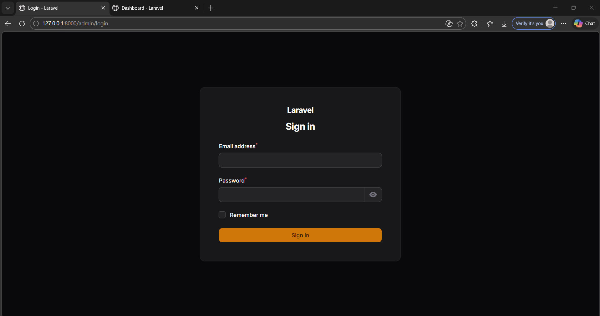
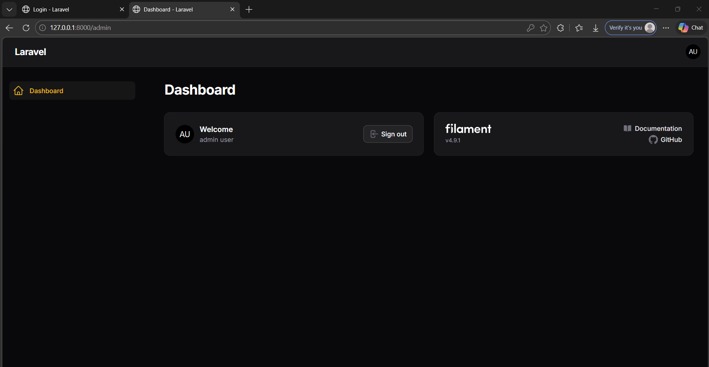

# Laporan Praktikum Pemrograman Web Lanjut

## Identitas Mahasiswa

| Keterangan | Data |
|------------|------|
| **Nama**   | Fikar Bahrul Santoso |
| **NIM**    | 244107020160 |
| **Kelas**  | TI-2F |

---
## Jobsheet 1

Detail

---
## Langkah Install Filament v4

### A. Persiapan
1. Pastikan web server dan MySQL sudah berjalan.
2. Pastikan file .env sudah berisi konfigurasi database MySQL yang benar.
3. Jalankan migrasi Laravel terlebih dahulu agar tabel dasar terbentuk.

Perintah yang digunakan:

	php artisan migrate

### B. Install Package Filament
1. Install Filament v4 menggunakan Composer.
2. Tunggu proses download dependency sampai selesai.

Perintah yang digunakan:

	composer require filament/filament:"^4.0"

### C. Install Panel Builder
1. Jalankan installer panel Filament.
2. Isi Panel ID dengan admin.
3. Saat pertanyaan GitHub star muncul, pilih no.

Perintah yang digunakan:

	php artisan filament:install --panels

### D. Membuat User Admin
1. Buat akun admin agar bisa login ke panel.
2. Isi data user sesuai jobsheet.

Perintah yang digunakan:

	php artisan make:filament-user

Contoh data:
1. Name: admin user
2. Email: admin@gmail.com
3. Password: 12345678

### E. Akses Panel Admin
Jika menggunakan php artisan serve:
1. Jalankan server:

	php artisan serve

2. Buka URL:
   http://127.0.0.1:8000/admin/login

Jika akses langsung lewat web server lokal (tanpa virtual host), gunakan URL yang menyertakan folder project dan public:
http://localhost/PemrogramanWebLanjut/PWL/Week-05/PraktikumPWL/public/admin/login

---
## E. Analisis & Diskusi

### 1. Apa kelebihan Filament dibanding membuat admin panel manual?
Filament mempercepat pengembangan karena banyak fitur admin sudah siap pakai, seperti autentikasi panel, CRUD resource, tabel, form, filter, notifikasi, dan otorisasi berbasis Laravel. Developer jadi fokus ke logika bisnis, bukan membangun komponen admin dari nol.

### 2. Mengapa Filament menggunakan Livewire?
Livewire memungkinkan antarmuka yang interaktif tanpa banyak menulis JavaScript kompleks. Komponen Filament dapat memanfaatkan state dan validasi di sisi server (PHP) secara langsung, sehingga integrasi dengan Laravel lebih natural, produktivitas meningkat, dan kode lebih konsisten dalam satu stack.

### 3. Apa perbedaan SQLite dan MySQL dalam development?
SQLite ringan karena berbasis file tunggal, cocok untuk prototipe cepat, testing lokal sederhana, dan setup awal tanpa server database terpisah. MySQL lebih cocok untuk skenario aplikasi nyata karena mendukung concurrency lebih baik, manajemen user-host privilege, tuning performa, dan operasi data skala lebih besar.

### 4. Apa fungsi Panel Builder?
Panel Builder berfungsi menghasilkan struktur panel admin Filament secara otomatis, termasuk provider panel, route panel, halaman bawaan, serta integrasi aset. Dengan Panel Builder, pembuatan area admin menjadi terstandar, cepat, dan mudah dikembangkan ke banyak panel jika dibutuhkan.

