# Laporan Praktikum Pemrograman Web Lanjut

## Identitas Mahasiswa

| Keterangan | Data |
|------------|------|
| **Nama**   | Fikar Bahrul Santoso |
| **NIM**    | 244107020160 |
| **Kelas**  | TI-2F |

---

## Jobsheet 1 (Jika sesuai GClass Jobsheet 10)

Detail

**Membuat Sort untuk Title**

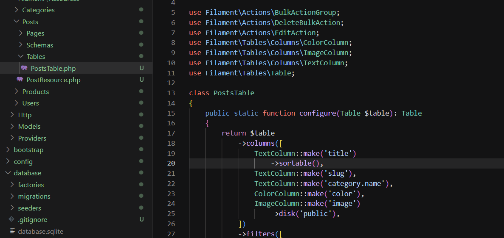
  

**Sort untuk Title (Ascending)**

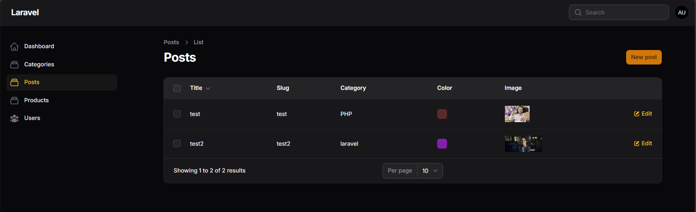

  

**Sort untuk Title (Descending)**
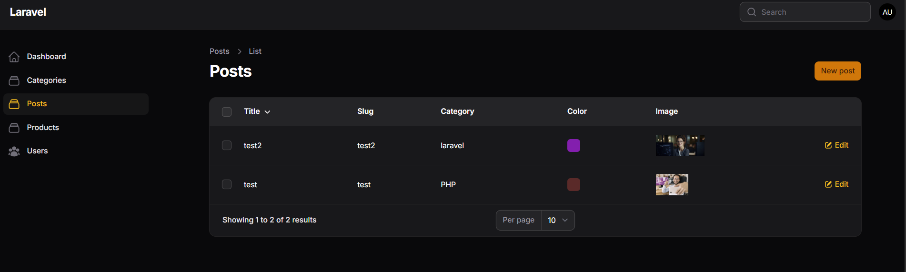
  
  

**Membuat Sort untuk Slug**

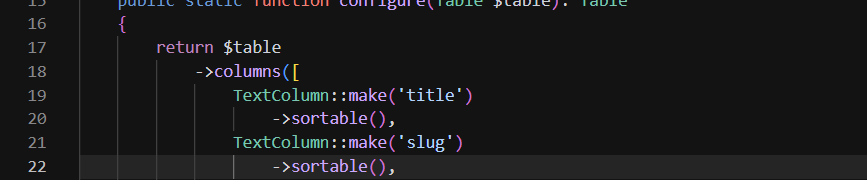
  

**Sort untuk Slug (Ascending)**

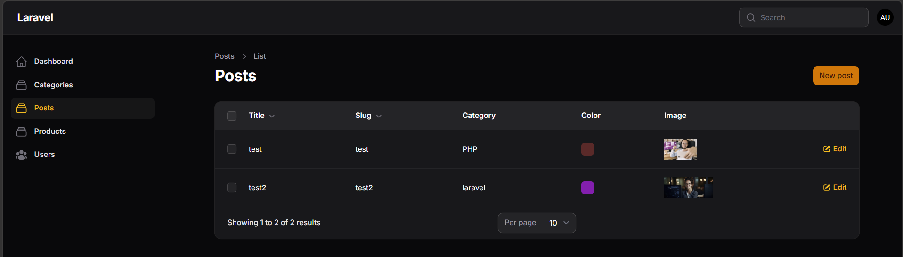

  

**Sort untuk Slug (Descending)**

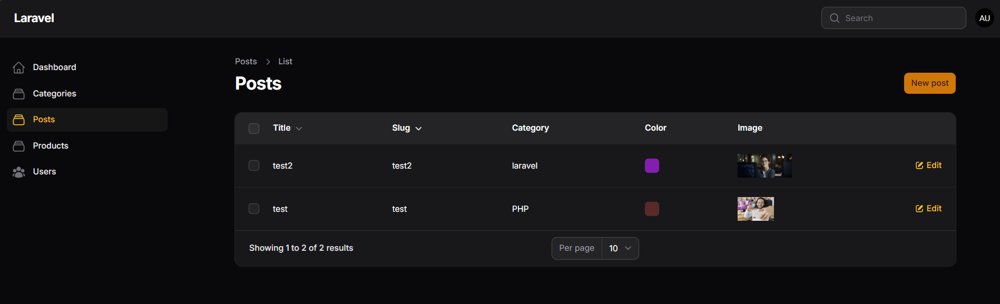

  
  

**Membuat Sort untuk Category**

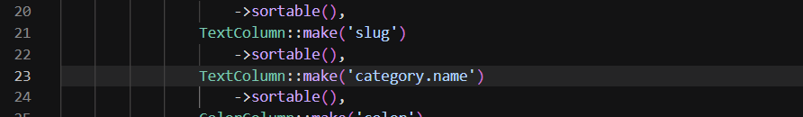
  

**Sort untuk Category (Ascending)**

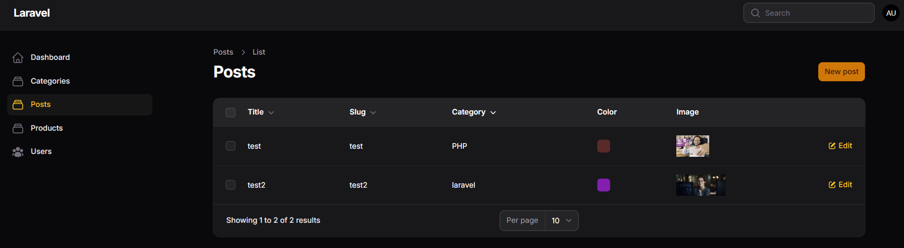

  

**Sort untuk Category (Descending)**

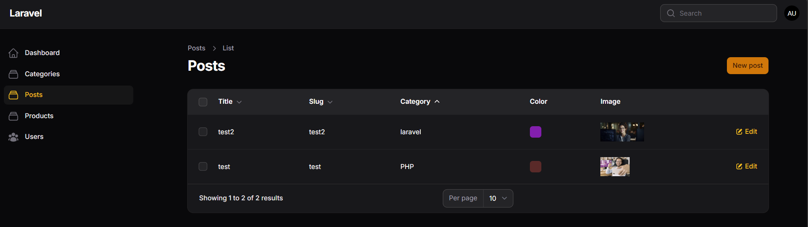

  
  

**Membuat Sort untuk Created At (Tanggal)**

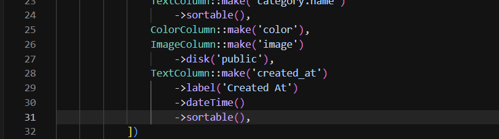

  

**Sort untuk Created At (Ascending)**

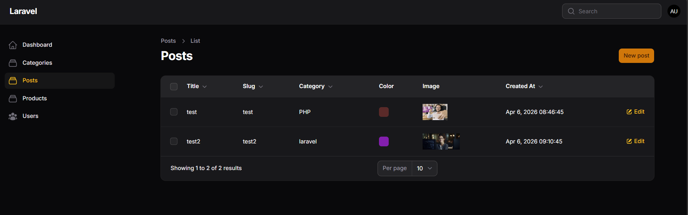

  

**Sort untuk Created At (Descending)**

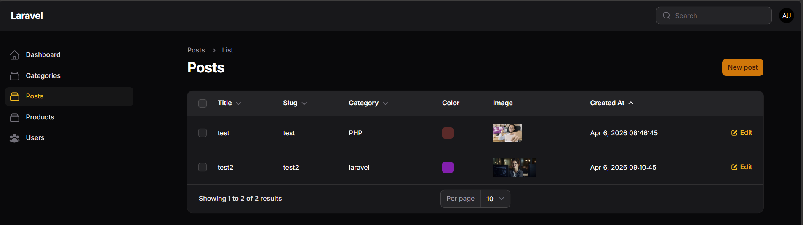

  
  

**Mengatur Default Sorting**

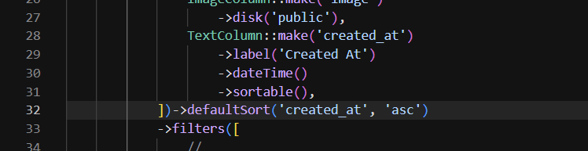
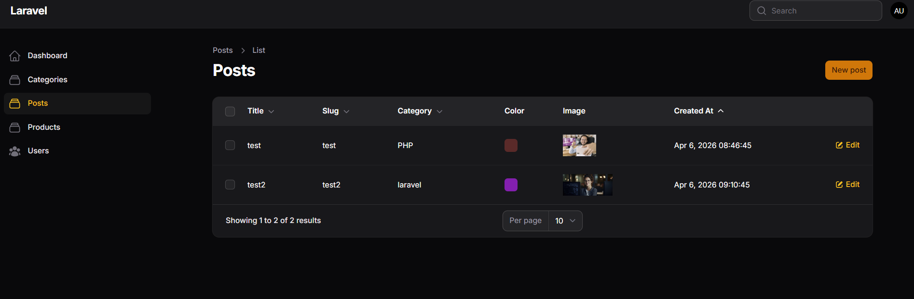
  

## L. Analisis & Diskusi

### 1. Mengapa sorting penting pada admin panel?
Sorting adalah fitur krusial di admin panel karena membantu pengguna menemukan data dengan cepat tanpa harus scroll panjang atau menggunakan filter yang kompleks. Saat data berkembang jutaan record, kemampuan mengurutkan berdasarkan judul, tanggal, atau kategori membuat manajemen data jauh lebih efisien. Tanpa sorting, pengguna akan kesulitan mengidentifikasi record terbaru, terpopuler, atau bermasalah, sehingga produktivitas admin panel menurun signifikan.

### 2. Apa perbedaan sortable biasa dengan defaultSort()?
`sortable()` adalah metode yang mengaktifkan fitur sorting interaktif pada kolom tertentu di tabel, memungkinkan pengguna mengklik header kolom untuk mengurutkan ascending atau descending sesuai kebutuhan mereka saat itu. Sedangkan `defaultSort()` menetapkan urutan default ketika halaman pertama kali dimuat, tanpa pengguna harus melakukan aksi apapun. Singkatnya, `sortable()` memberikan kontrol kepada pengguna, sementara `defaultSort()` menyiapkan pengalaman awal yang optimal berdasarkan preferensi aplikasi.

### 3. Mengapa relasi tetap bisa di-sort?
Relasi tetap bisa di-sort karena Filament secara otomatis menangani join antar tabel saat diperlukan. Saat developer menulis `TextColumn::make('category.name')->sortable()`, Filament mendeteksi bahwa 'category' adalah relasi dan secara smart membuat query dengan JOIN ke tabel categories, kemudian mengurutkan berdasarkan kolom 'name' di tabel relasi tersebut. Pendekatan ini membebaskan developer dari menulis query manual yang kompleks, sehingga sorting relasi terasa seamless dan natural.

### 4. Kapan kita menggunakan desc sebagai default?
`desc` (descending) digunakan sebagai default ketika data terbaru atau terpenting perlu ditampilkan paling atas. Contoh umum adalah sorting tanggal pembuatan dengan `->defaultSort('created_at', 'desc')` sehingga post atau artikel terbaru tampil duluan. Demikian pula untuk kolom views atau popularity, menampilkan yang paling banyak dilihat duluan membuat pengguna langsung melihat konten paling relevan. Sebaliknya, `asc` cocok untuk data yang diurutkan alfabetik atau berdasarkan prioritas ranking dari kecil ke besar, misalnya ID atau nomor urut.

---

## Jobsheet 2 (Jika sesuai GClass Jobsheet 11)

Detail

**Membuat Search untuk Title**

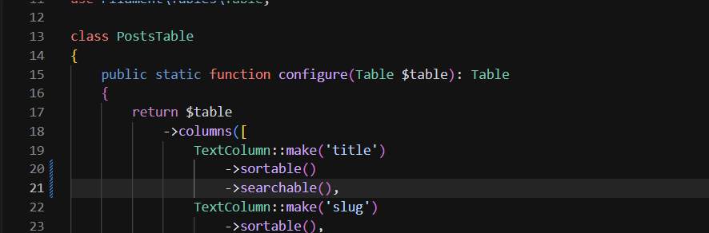
  

**Search untuk Title (Hasil)**
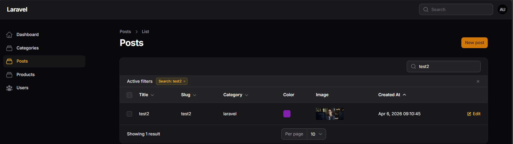
  

**Membuat Search untuk Slug**

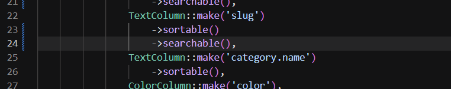
  

**Search untuk Slug (Hasil)**

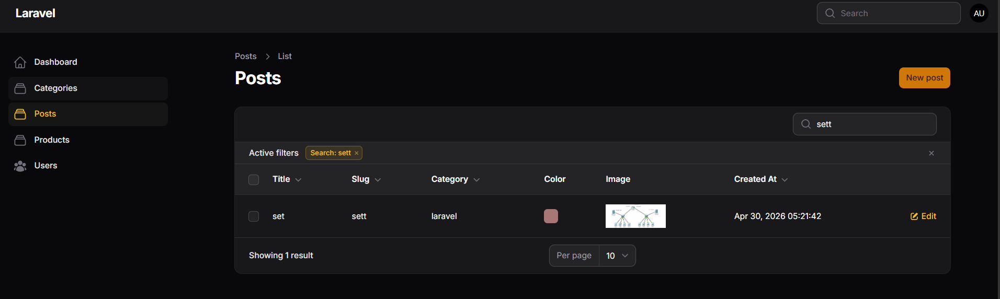
  
  

**Membuat Search untuk Category**

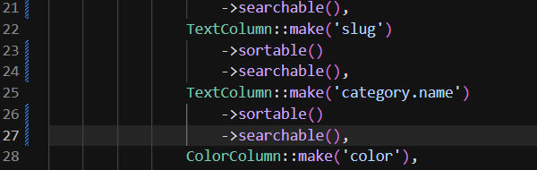
  

**Search untuk Category (Hasil)**

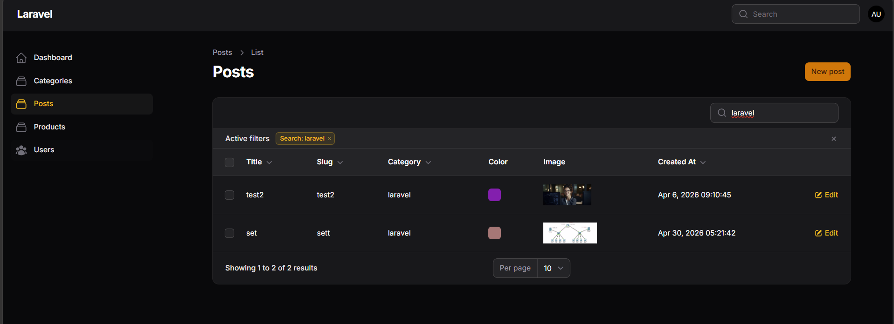
  
  

**Membuat Filter untuk Created At**

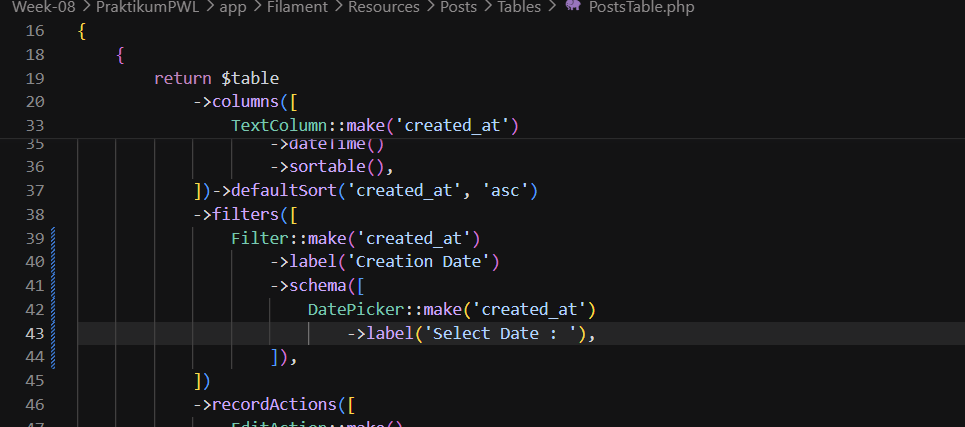
  

**Filter untuk Created At (Hasil)**

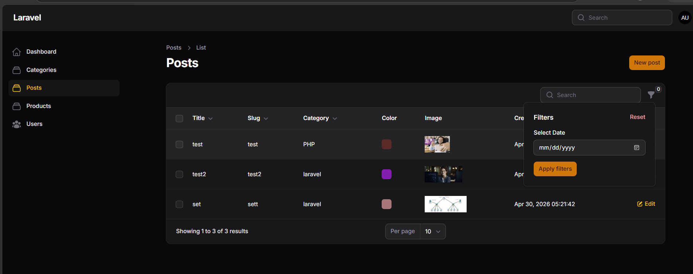

  
  

**Membuat Query Logic untuk Created At**

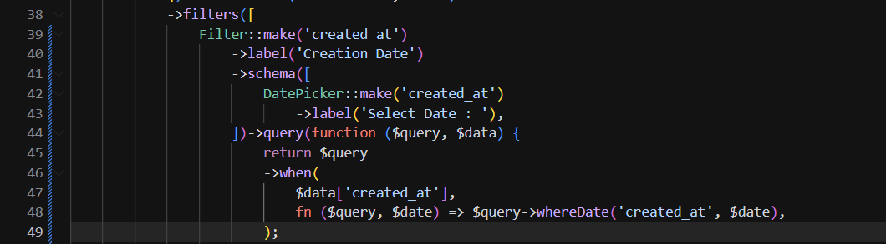
  

**Membuat Query Logic untuk Created At (Hasil Logika)**
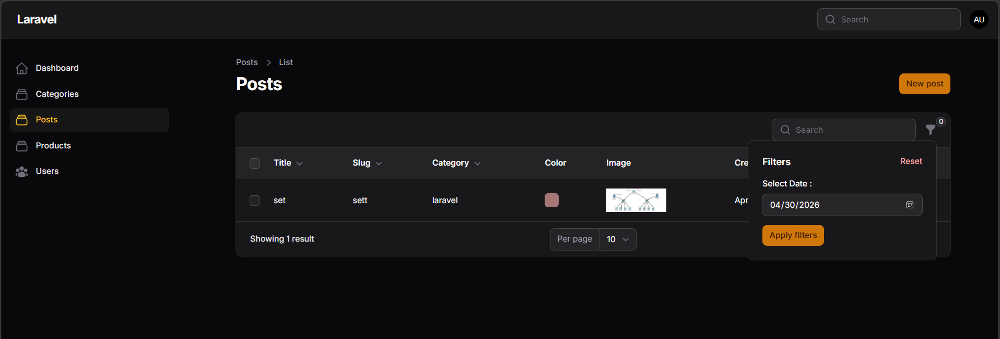
  
  

**Membuat Filter untuk Created At(Relasi Dengan Category)**
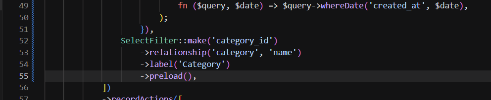
  

**Membuat Filter untuk Created At(Relasi Dengan Category)(Hasil)**
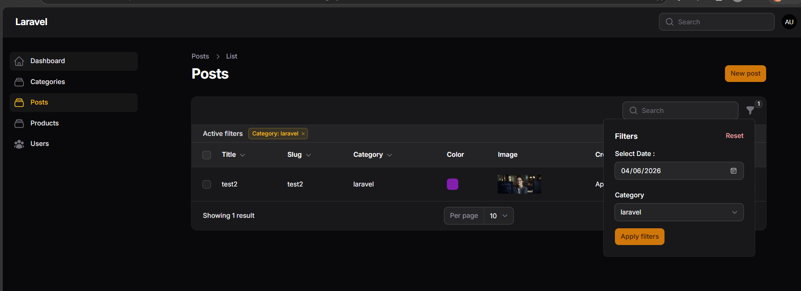
 
## H. Analisis & Diskusi

### 1. Mengapa search tidak cocok untuk filter tanggal?
Search (text search) dirancang untuk pencocokan teks/substring dan tidak sensitif terhadap format waktu. Field tanggal biasanya menyimpan tanggal + waktu (`datetime`), sehingga pencarian teks akan sulit menangkap semua variasi format dan rentang (mis. semua record pada satu hari). Untuk kebutuhan tanggal lebih tepat menggunakan filter berbasis DatePicker yang menghasilkan query `whereDate` atau range, sehingga hasilnya akurat dan konsisten.

### 2. Apa fungsi `relationship()` pada `SelectFilter`?
`relationship('category', 'name')` memberi tahu Filament bahwa opsi filter diambil dari relasi Eloquent `category` dan menampilkan kolom `name` sebagai label. Filament otomatis memuat (preload) data relasi dan membuat filter yang menghubungkan `category_id` ke tabel categories, sehingga pengguna bisa memilih kategori tanpa menulis query manual.

### 3. Mengapa kita perlu `whereDate()` pada query filter?
Kolom `created_at` biasanya bertipe `datetime` (mencakup waktu). Jika ingin memfilter berdasarkan tanggal saja (abaikan jam), gunakan `whereDate('created_at', $date)` supaya perbandingan hanya pada bagian tanggal, bukan seluruh timestamp. Ini mencegah mismatch ketika waktu berbeda namun tanggalnya sama.

### 4. Apa perbedaan `searchable()` dan `filters()`?
`searchable()` mengaktifkan pencarian teks (global atau per-kolom) dan berguna untuk menemukan record lewat kata kunci cepat. `filters()` menyediakan kontrol terstruktur (DatePicker, SelectFilter, dll.) yang menghasilkan query spesifik (mis. range, relasi, exact match). Singkatnya: `searchable()` untuk pencarian teks fleksibel; `filters()` untuk kriteria terstruktur dan presisi.

---