# Laporan Praktikum Pemrograman Web Lanjut

## Identitas Mahasiswa

| Keterangan | Data |
|------------|------|
| **Nama**   | Fikar Bahrul Santoso |
| **NIM**    | 244107020160 |
| **Kelas**  | TI-2F |

---

## Jobsheet 12

Detail

**Membuat ID untuk Posts**
  

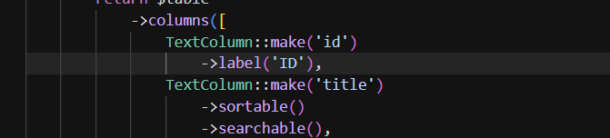
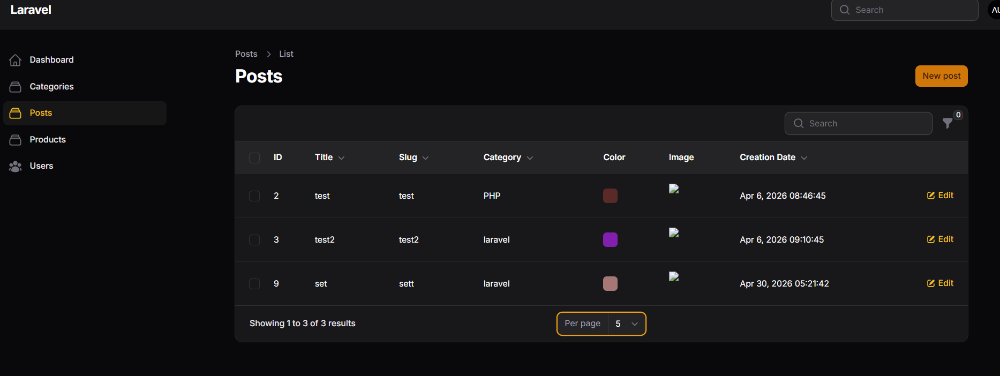

  
  

**Membuat Tags untuk Posts**
  

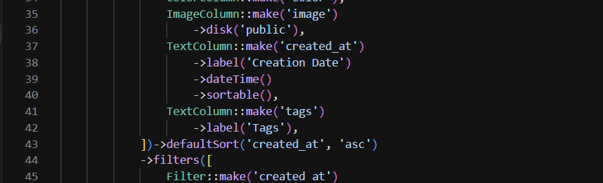
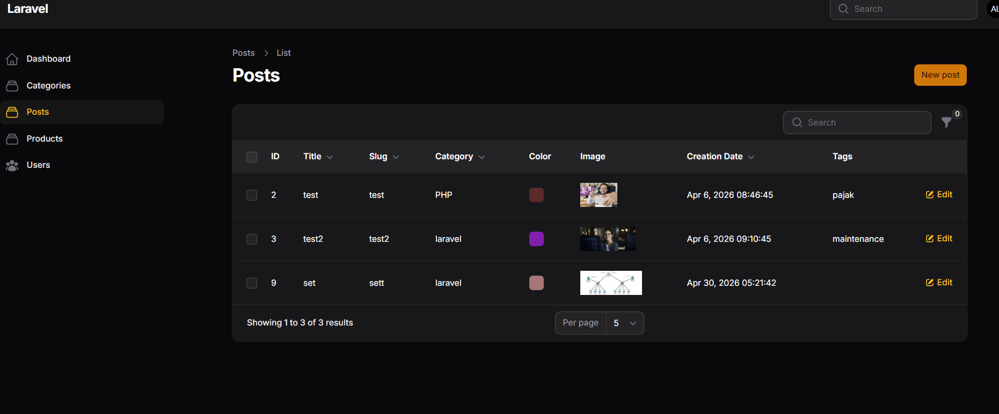
  
  

**Membuat Published untuk Posts**
  

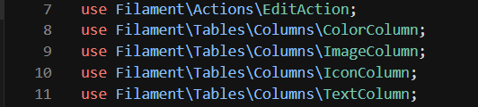
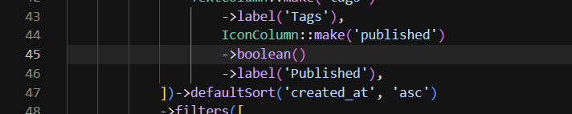
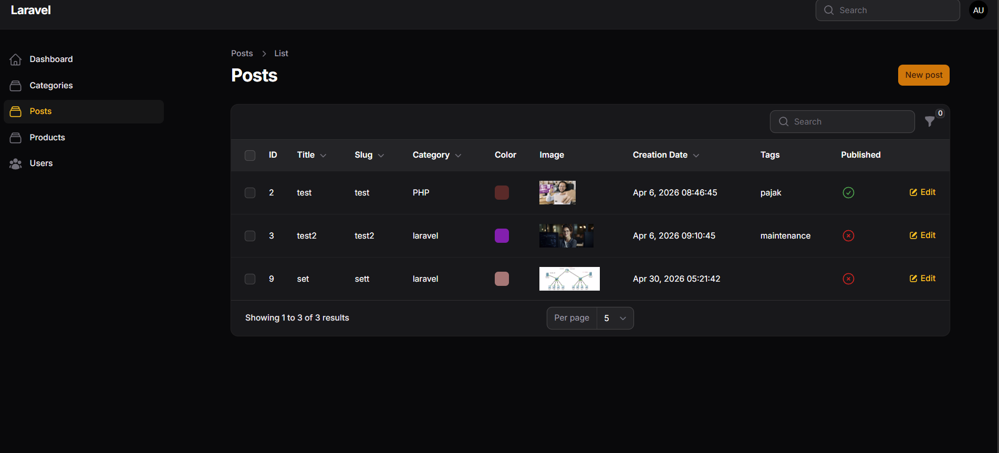
  
  

**Menambah Toggle untuk ID**
  

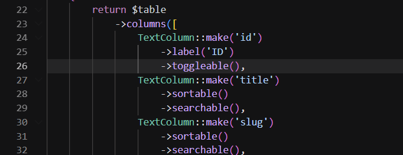
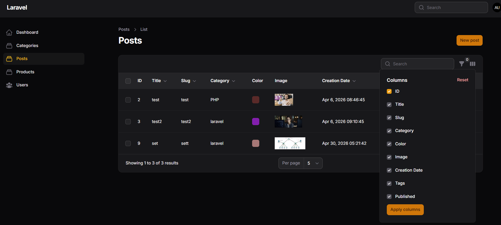
  
  

**Menambah Toggle untuk Tags(tersembunyi secara default)**
  

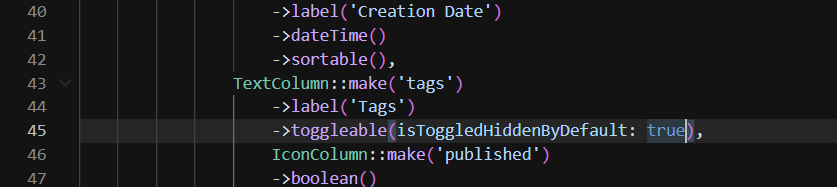
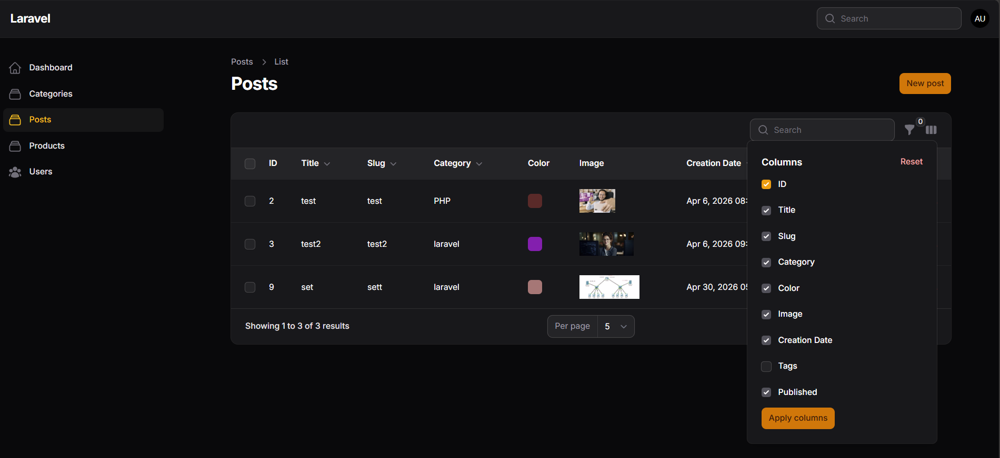
  
  

**Menambah Toggle untuk semua kolom**
  

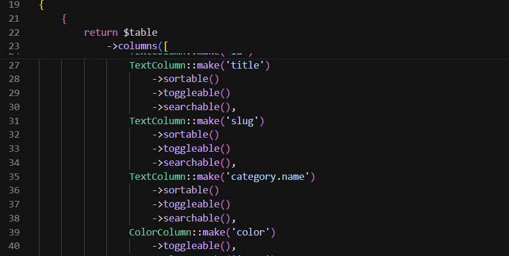
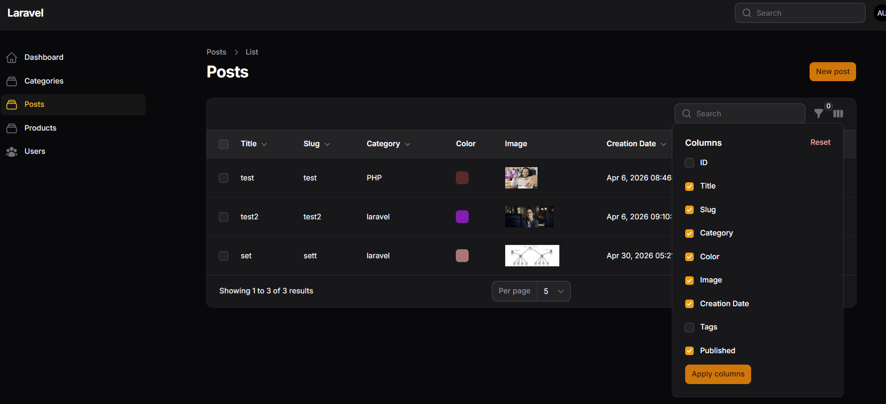
  
  

## J. Analisis & Diskusi

### 1. Mengapa toggle column penting pada admin panel?
Toggle column penting karena kebutuhan informasi tiap pengguna admin bisa berbeda. Dengan fitur ini, admin dapat menampilkan hanya kolom yang relevan untuk tugas saat itu sehingga tabel lebih rapi, fokus, dan cepat dibaca. Saat jumlah kolom banyak, toggle juga membantu mengurangi noise visual, mempercepat proses monitoring data, dan meningkatkan kenyamanan penggunaan pada layar yang lebih kecil.

### 2. Apa perbedaan `toggleable()` biasa dengan `isToggledHiddenByDefault`?
`toggleable()` biasa membuat kolom bisa ditampilkan/disembunyikan oleh pengguna, tetapi secara default kolom tetap terlihat saat halaman pertama kali dibuka. Sementara itu, `toggleable(isToggledHiddenByDefault: true)` membuat kolom tetap bisa di-toggle, namun kondisi awalnya disembunyikan. Jadi perbedaannya ada pada state awal kolom: langsung tampil atau tersembunyi dari awal.

### 3. Mengapa preferensi kolom tetap tersimpan?
Preferensi kolom tetap tersimpan karena state tabel disimpan oleh Filament untuk setiap pengguna (umumnya melalui session), sehingga konfigurasi tampilan tidak kembali ke default setiap kali halaman dimuat ulang. Mekanisme ini membuat pengalaman penggunaan lebih personal dan efisien karena pengguna tidak perlu mengatur ulang kolom berulang kali.

### 4. Kapan sebaiknya kolom disembunyikan secara default?
Kolom sebaiknya disembunyikan secara default ketika informasi tersebut bersifat sekunder, jarang dipakai, atau hanya dibutuhkan pada kondisi tertentu. Contohnya seperti slug, metadata teknis, atau detail tambahan yang tidak selalu diperlukan untuk overview harian. Dengan menyembunyikan kolom non-prioritas, tampilan awal menjadi lebih bersih dan pengguna tetap bisa menampilkannya kapan saja jika dibutuhkan.

---
