# Laporan Praktikum Pemrograman Web Lanjut

## Identitas Mahasiswa

| Keterangan | Data |
|------------|------|
| **Nama**   | Fikar Bahrul Santoso |
| **NIM**    | 244107020160 |
| **Kelas**  | TI-2F |

---

## Jobsheet 13

Detail

**Membuat Delete Action untuk Posts**
  

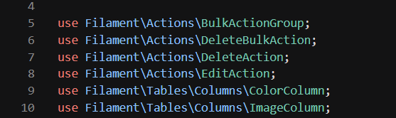
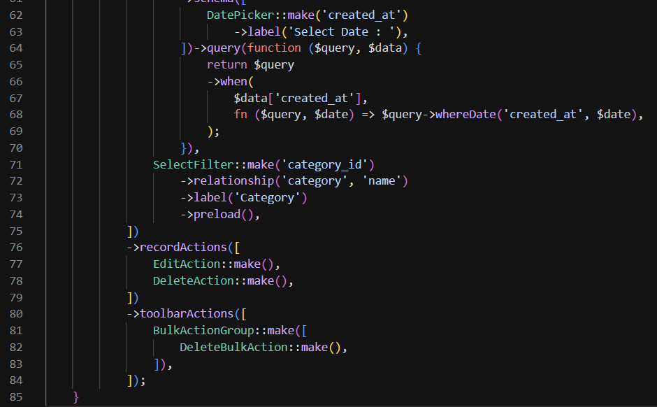
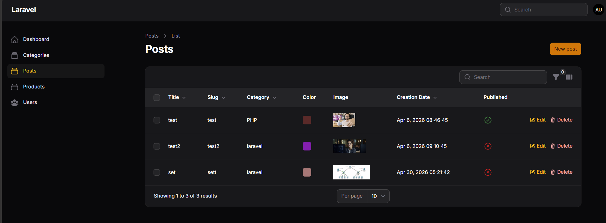
    

**Menambah Replicate (Copy) Action**
  

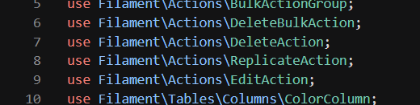
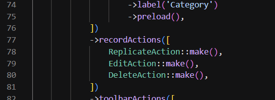
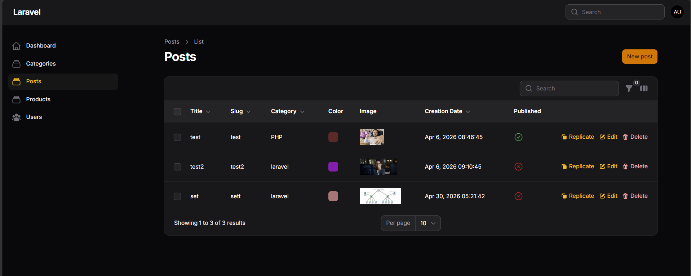
    

**Menambah Custom Action, Form Input, Update Data (Logic), Icon**
  

**Custom Action**

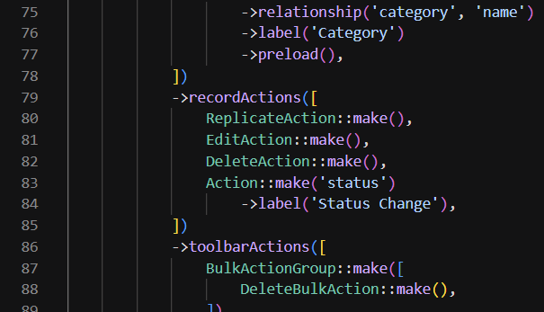
  

**Form Input**

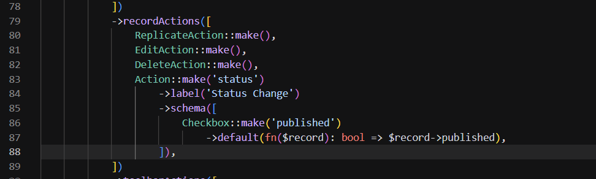
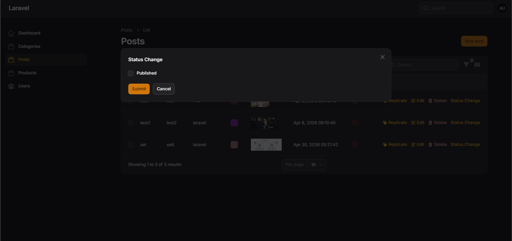
  

**Logic Update Data**

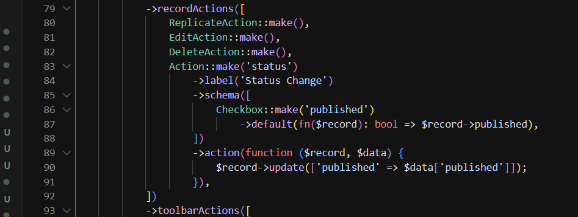
  

**Heroicon untuk Status**

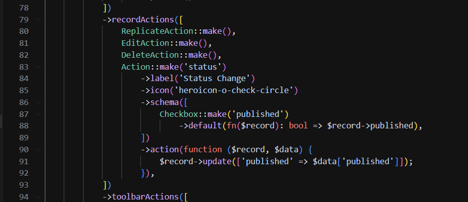
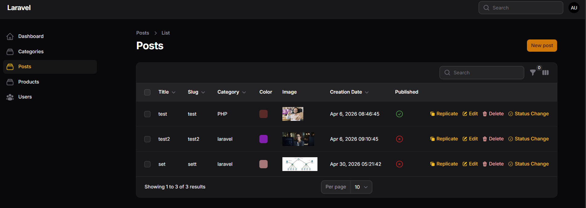

## K. Analisis & Diskusi

### 1. Mengapa action di tabel lebih efisien dibanding halaman edit?
Action langsung di tabel mengurangi langkah navigasi dan waktu yang dibutuhkan untuk menjalankan tugas umum (mis. hapus, copy, toggle status). Pengguna dapat melakukan operasi cepat tanpa membuka halaman detail, sehingga alur kerja menjadi lebih produktif terutama saat menangani banyak record.

### 2. Apa perbedaan predefined action dan custom action?
Predefined action adalah aksi bawaan Filament yang langsung memberikan fungsi umum (mis. delete, edit, view) dengan sedikit atau tanpa konfigurasi. Custom action dibuat developer untuk logika spesifik, memungkinkan penambahan form input, validasi, dan behavior yang tidak tersedia di aksi bawaan.

### 3. Bagaimana cara menambahkan validasi dalam custom action?
Tambahkan fields pada `Action::form([...])` lalu gunakan `->action(function (array $data, Model $record) { ... })` untuk memproses input; di dalamnya gunakan `Validator::make($data, [...])->validate()` atau `->validate()` pada form sebelum menyimpan agar data memenuhi aturan sebelum dieksekusi.

### 4. Kapan kita menggunakan Replicate?
Replicate berguna saat ingin membuat salinan record sebagai draft atau template untuk entri baru (mis. duplikasi produk atau post serupa). Gunakan ketika struktur data mirip dan hanya beberapa field yang perlu diubah setelah copy, sehingga mempercepat pembuatan record baru.

---
