# Laporan Praktikum Pemrograman Web Lanjut

## Identitas Mahasiswa

| Keterangan | Data |
|------------|------|
| **Nama**   | Fikar Bahrul Santoso |
| **NIM**    | 244107020160 |
| **Kelas**  | TI-2F |

---

## Jobsheet 14

Detail

**Implementasi Relationship pada Form & Membuat Dropdown Searchable**
  

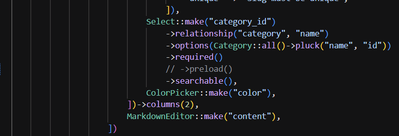
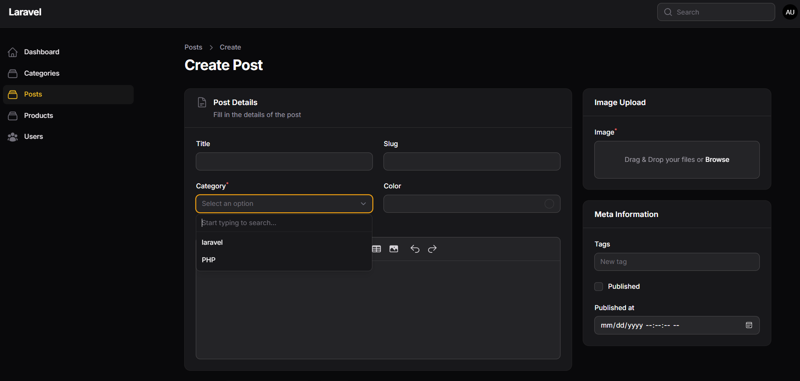
    

**Membuat Relationship pada Model**
  

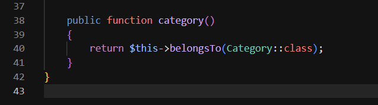
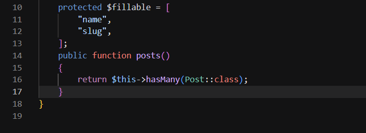
    

**Menampilkan Data Relasi pada Table**
  

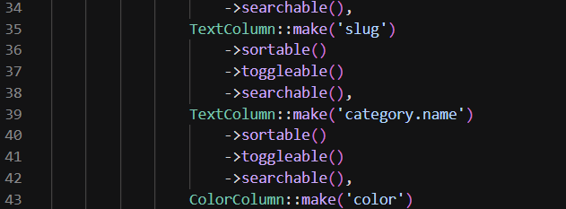
    

**Membuat Relationship Manager**
  

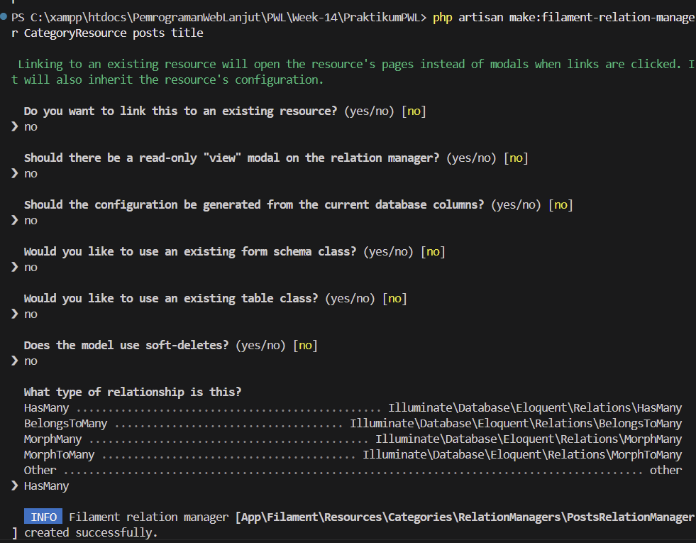
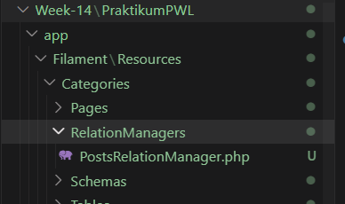
    

**Menghubungkan Relationship Manager**
  

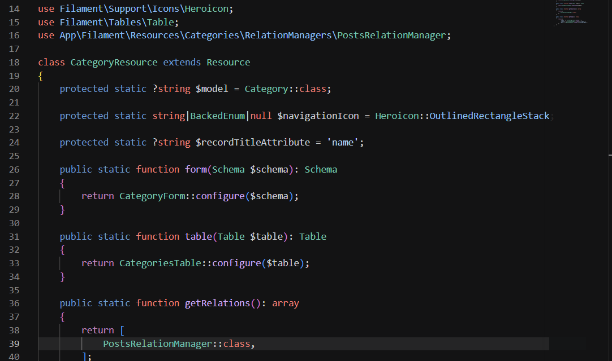
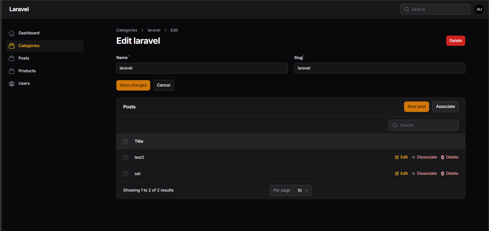
    

**Menambahkan Kolom pada Relationship Table**
  

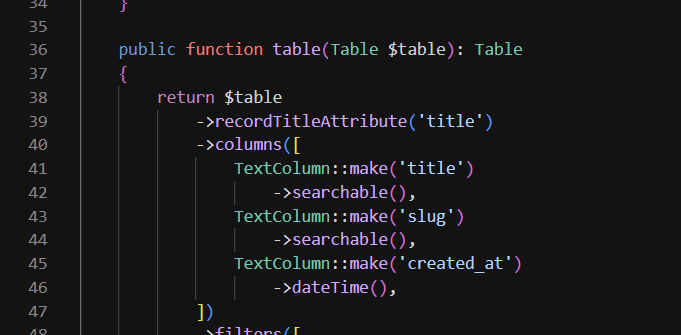
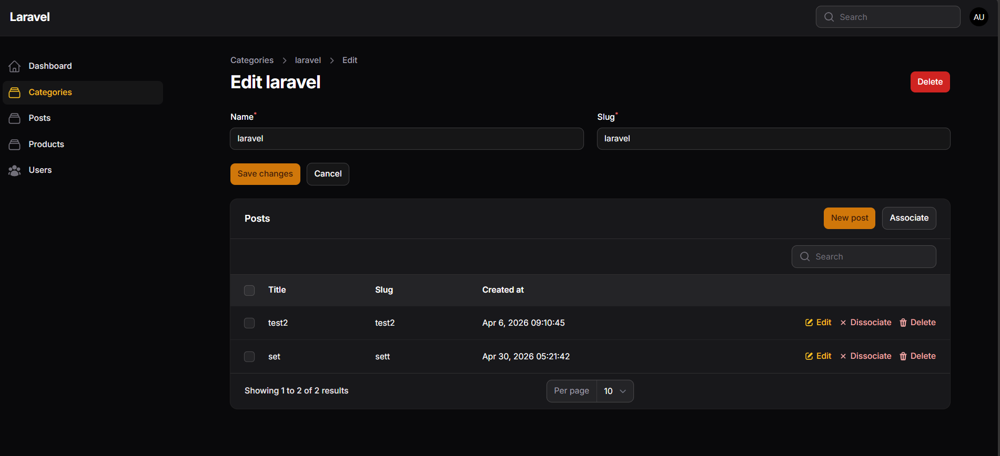
    

**Membuat Form Create Post pada Relationship**
  

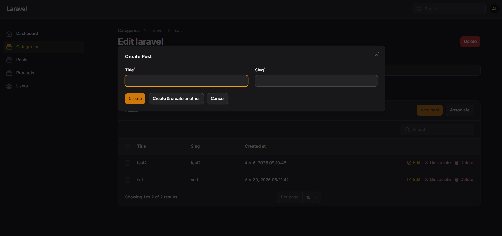

## O. Analisis & Diskusi

### 1. Apa perbedaan `relationship()` dengan `options()`?
`relationship()` digunakan untuk menghubungkan field form langsung ke relasi model, sehingga data yang ditampilkan dan disimpan mengikuti struktur relasi yang ada. Sementara itu, `options()` hanya mengisi daftar pilihan secara manual atau dari query tertentu, tanpa keterikatan langsung ke relasi Eloquent.

### 2. Mengapa `searchable` penting untuk dataset besar?
`searchable` penting karena membantu pengguna menemukan data lebih cepat tanpa harus men-scroll seluruh daftar. Pada dataset besar, fitur ini meningkatkan efisiensi pencarian, mengurangi beban visual, dan membuat input relasi lebih mudah digunakan.

### 3. Apa fungsi Relationship Manager pada Filament?
Relationship Manager berfungsi untuk mengelola data relasi antar model langsung dari halaman resource utama. Dengan fitur ini, data anak seperti `Post` pada `Category` bisa dibuat, diedit, atau dihapus tanpa harus berpindah halaman.

### 4. Kapan menggunakan `HasMany` dan `BelongsTo`?
Gunakan `HasMany` pada model induk yang memiliki banyak data turunan, misalnya satu `Category` memiliki banyak `Post`. Gunakan `BelongsTo` pada model anak yang hanya dimiliki oleh satu induk, misalnya satu `Post` dimiliki oleh satu `Category`.

---
