# Laporan Praktikum Pemrograman Web Lanjut

## Identitas Mahasiswa

| Keterangan | Data |
|------------|------|
| **Nama**   | Fikar Bahrul Santoso |
| **NIM**    | 244107020160 |
| **Kelas**  | TI-2F |

---

## Jobsheet 15

Detail

**Rollback Migration**
  

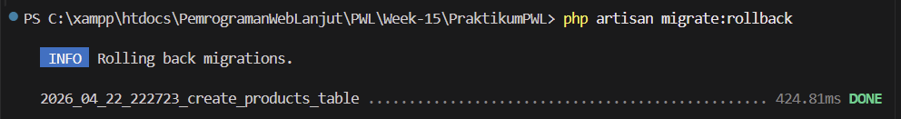
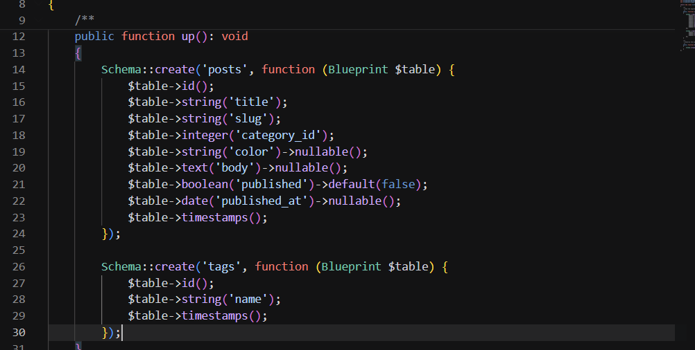
    

**Membuat Tag Table**
  

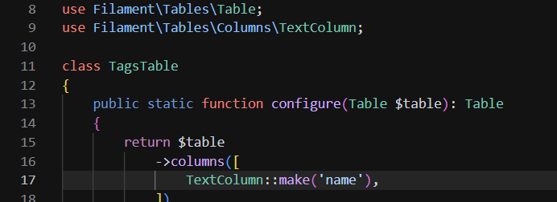
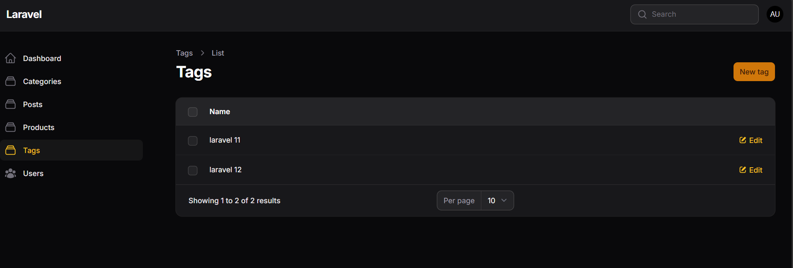
    

**Membuat Pivot Table**
  

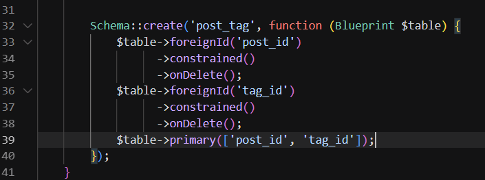
    

**Migrate Tag**
  

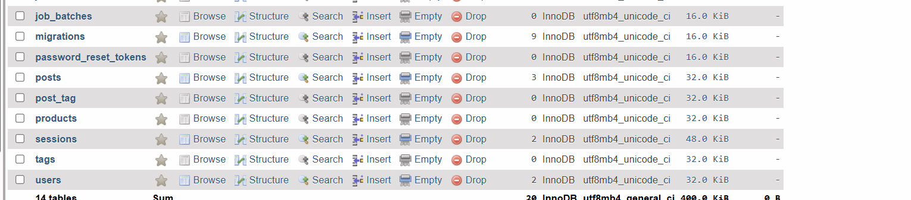

    

**Resource Tag**
  

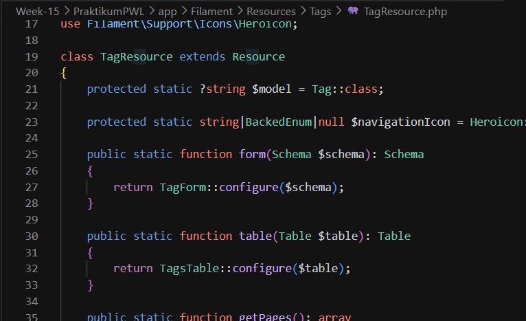
    

**Edit Model Tag**
  

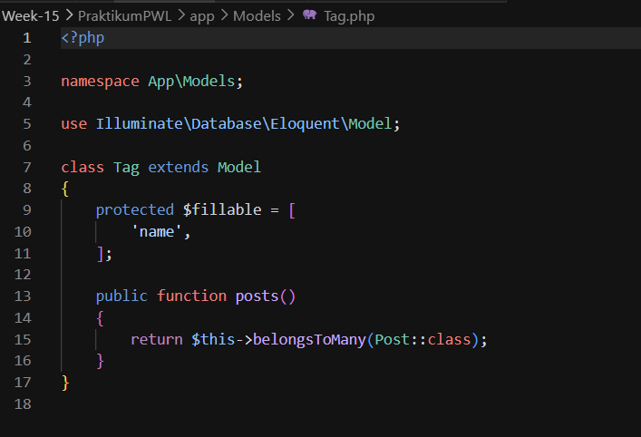
    

**Form Tag**
  

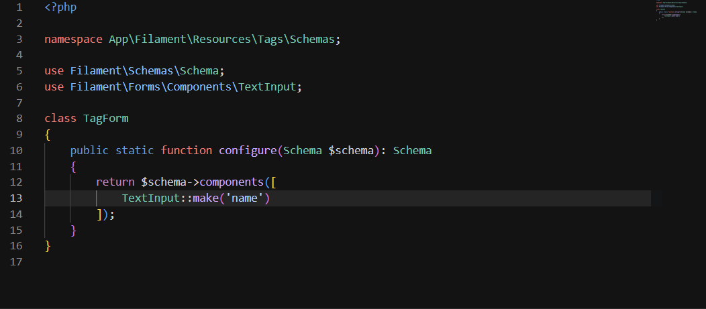
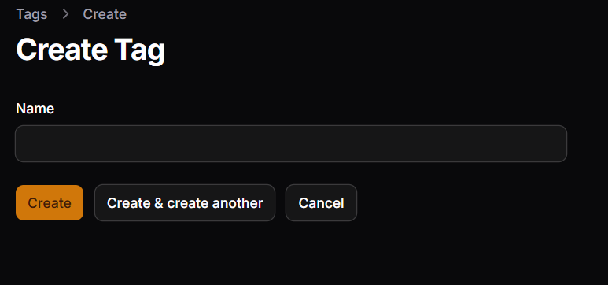
    

**Relationship Model Post & Tag**
  

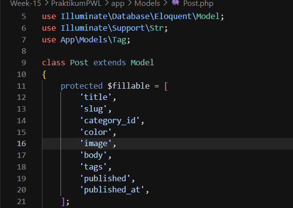
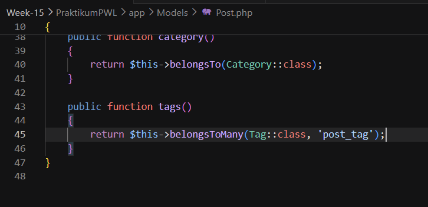
    

**Relationship Post Form**
  

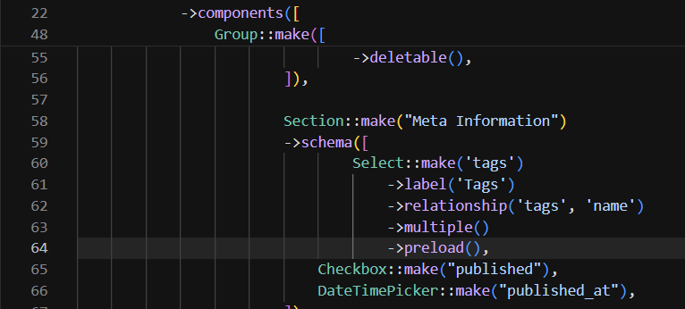
    

**Hasil Post Form**
  

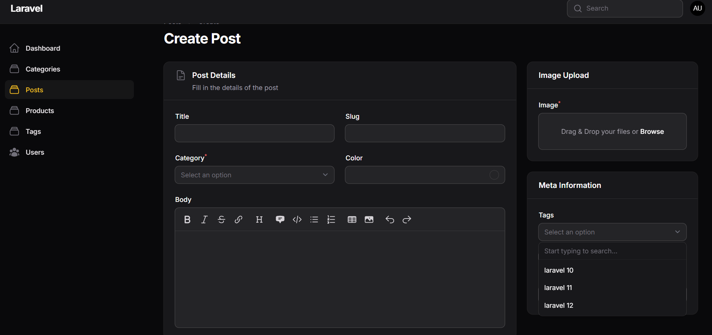
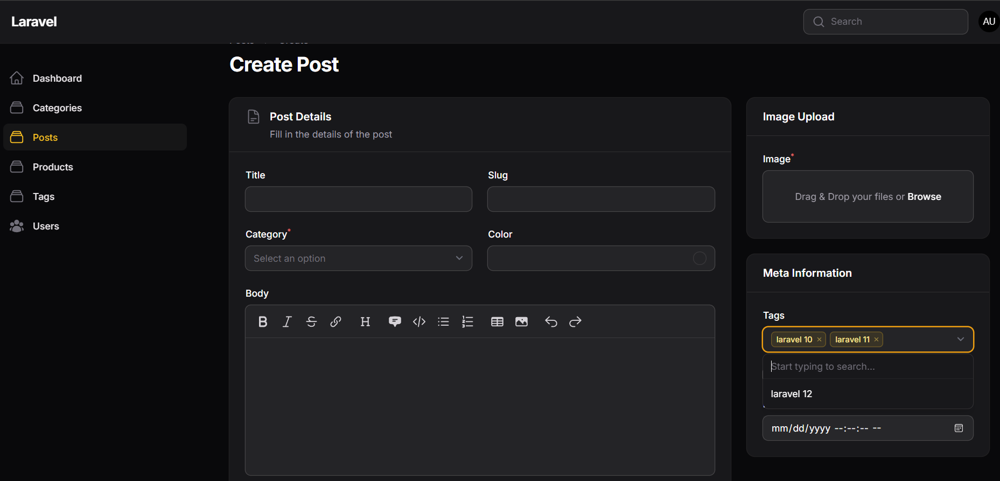
    

**Menghubungkan Relationship Manager**
  

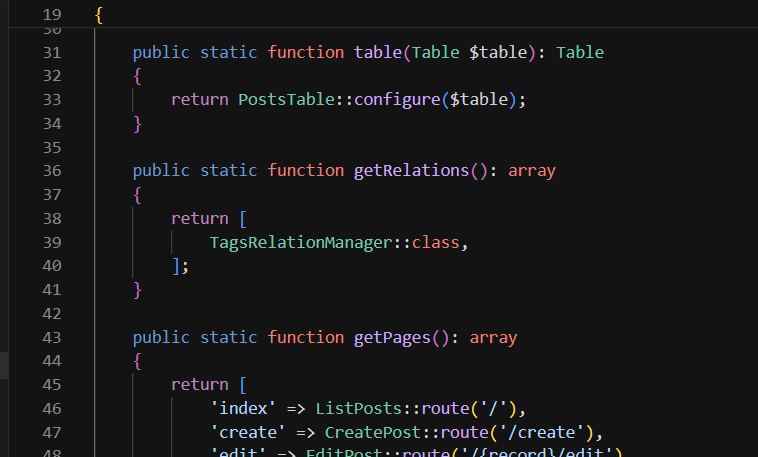
    

**Fitur Relationship Manager**
  

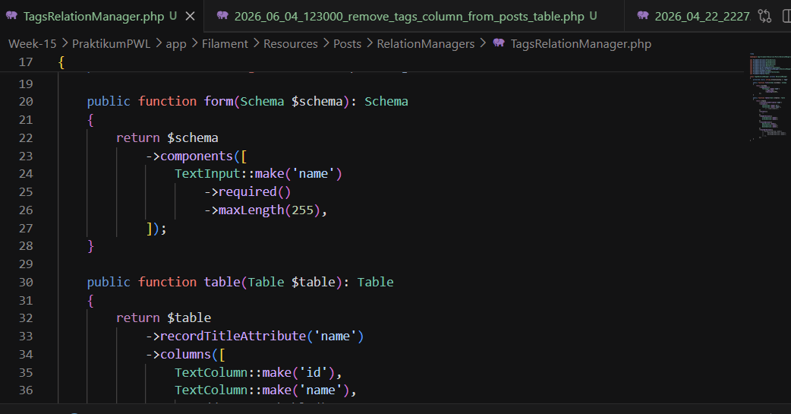
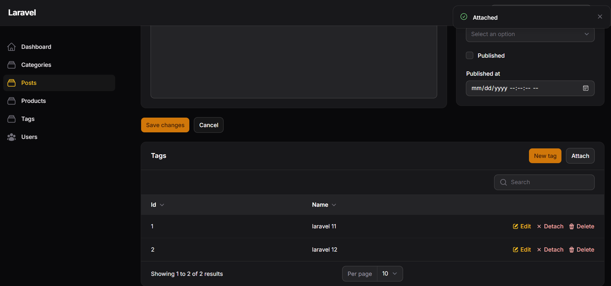
    

## T. Analisis & Diskusi

### 1. Apa perbedaan HasMany dan Many-to-Many?
`HasMany` (one-to-many) berarti satu entitas memiliki banyak entitas lain dan disimpan dengan foreign key di tabel anak; `Many-to-Many` berarti kedua entitas bisa saling berhubungan banyak-ke-banyak dan membutuhkan tabel pivot untuk menyimpan pasangan relasi.

### 2. Mengapa pivot table diperlukan?
Pivot table menyimpan hubungan many-to-many secara terpisah sehingga menjaga normalisasi, memungkinkan penambahan metadata relasi (mis. timestamps atau atribut pivot), dan mempermudah query/penegakan integritas referensial.

### 3. Apa fungsi attach dan detach pada Filament?
`attach` menambahkan hubungan antara record yang sudah ada (memasukkan baris ke tabel pivot), sedangkan `detach` menghapus hubungan tersebut (menghapus baris pivot). Keduanya bekerja pada relasi many-to-many tanpa membuat atau menghapus model induk.

### 4. Mengapa JSON column kurang baik untuk relasi?
Menyimpan relasi di kolom JSON menghilangkan integritas referensial (tidak ada foreign key), menyulitkan query dan join, kurang efisien untuk indexing dan skala besar, serta menyulitkan update/validasi data relasional.

---